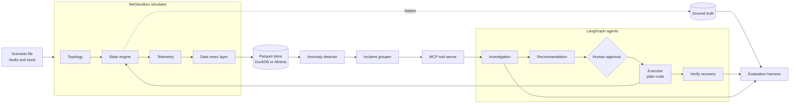
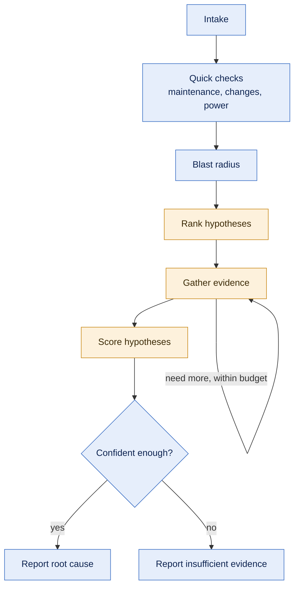
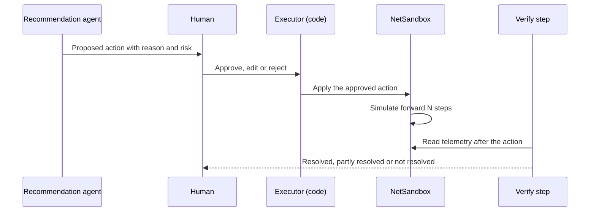
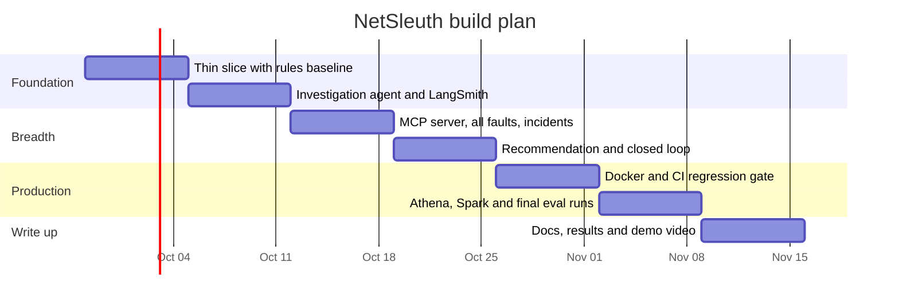

<div align="center">

# NetSleuth

**AI agents that investigate cable network outages, tested in a simulated network before they ever touch a real one.**


[What this is](#what-this-is) · [Status](#where-things-stand) · [Architecture](#how-it-works) · [Design choices](#design-choices) · [Evaluation](#how-i-measure-it) · [Roadmap](#roadmap) · [Full proposal](docs/proposal-v2.md)

</div>

---

## What this is

When something breaks in a cable network, the operations team gets a flood of alerts. Someone has to work out what actually failed, how many customers it hits, whether it was planned work, and what to send out to fix it. That first hour of detective work is what I want agents to do.

There's a catch. You can't build and test agents like that on a live network, and you almost never know for sure what the real root cause was. So I'm building two things:

1. **NetSandbox**, a simulator of a cable (HFC) network. It produces realistic, messy telemetry, lets me inject faults where I know the true answer, and accepts repair actions so I can see whether they worked.
2. **The agents**, built in LangGraph. They investigate an incident, recommend a fix, wait for a human to approve it, apply it in the sandbox, and check that the network recovered.

Every result gets compared against a plain rules engine and a single LLM prompt. If the agents don't beat those, I'll say so.

> This project uses no real operator data and does not try to copy any company's internal systems. Everything the agents see comes from the simulator.

## Where things stand

| Area | State |
|---|---|
| Design and requirements | Done. See [docs/proposal-v2.md](docs/proposal-v2.md) |
| Simulator | Starting week 1 (Sep 28, 2026) |
| Agents | Starting week 2 |
| Evaluation results | None yet. I'll publish them here once the holdout set has been run |

I update this table at the end of every week.

## How it works



Here's the flow in plain terms. A scenario file says which fault to inject, where, and when. The simulator runs the network forward in five minute steps and writes telemetry to Parquet. A simple detector flags odd behaviour, and a grouper bundles related alerts into one incident. The agents investigate that incident through tools served over MCP. The true answer is written somewhere the agents can't reach, and only the evaluation harness reads it.

### The investigation agent



Blue steps are plain Python. Orange steps are where the LLM makes a judgment call. I keep anything that can be a lookup or a rule in code, and use the model only where reasoning over evidence actually helps. Evidence gathering has a hard cap on tool calls, so an investigation can't wander forever.

### Safe remediation



The model never applies anything itself. It writes a proposal. A person approves it, and ordinary code carries it out. That's the pattern I'd want before letting any agent touch a real network.

## Design choices

These are the decisions that shape the project, and why I made them.

| Decision | What I chose | Why |
|---|---|---|
| Where the ground truth comes from | A simulator I control | Real outages rarely come with a confirmed root cause. A simulator gives me exact answers to score against. |
| What a dead device reports | Nothing at all | Cable monitoring data travels over the same network it watches. When an amplifier dies, the modems behind it go silent. Reasoning about missing data is a big part of the real job, so the simulator has to behave that way. |
| Who applies fixes | Plain code, after human approval | The LLM proposes. It never holds an approval or calls the action directly. |
| How much the LLM decides | Only the judgment steps | Fetching data and running known checks happens in code. This keeps runs cheaper, easier to review, and easier to debug. |
| Time travel during evaluation | Blocked in the storage layer | Every query is cut off at the moment the incident was detected, so an agent can't peek at the recovery. The verify step gets a later cutoff that the harness sets, never the agent. |
| What gets scored | Incidents, not single alerts | A fiber cut or a power outage sets off many alerts at once. Scoring them one by one would reward the wrong behaviour. |
| Baselines | A rules engine and a single prompt | I wrote both the faults and the agents, so a strong rules baseline is the honest check on whether the agent adds anything. |
| Tool boundary | MCP for all data access | It matches how agents plug into real time data sources in production, and keeps the tools reusable by other agents. |
| Local vs cloud data | DuckDB for development, Athena for the cloud demo | Same Parquet files and one storage interface, so the agents don't know which backend they're using. |
| Model provider | Anthropic API first, Bedrock as a second backend | Quick to start, and swappable later through one model interface. |

Everything I chose to leave out is listed in [the proposal](docs/proposal-v2.md#43-explicitly-out-of-scope), with reasons.

## How I measure it

**Three systems run on the same cases:** the LangGraph agent, a rules engine, and one LLM prompt with the same context. Every results table shows all three.

**Four data splits, used with discipline:**

| Split | Share | When I look at it |
|---|---|---|
| Dev | about 55% | Any time while building |
| Regression | about 15% | On every pull request that touches agents or prompts |
| Holdout | about 20% | Only at milestones, about three times in total |
| Novel | about 10% | Fault types I never build against. Written by someone else and sealed early |

**What I score** (all checked by code, no LLM needed):

* Root cause category, per incident
* Location of the fault, with partial credit when the agent is close in the network tree
* Whether alerts were grouped into the right incidents
* Whether decoys (planned maintenance, power cuts at customers' homes, congestion) were kept away from field crews
* Whether the agent says "I don't know" when it should, and only then
* Whether every piece of cited evidence holds up when I rerun the query
* Whether the recommended fix was right, and whether the network actually recovered
* Tool calls, tokens, time and cost per incident

An LLM judge is used for one thing only: how clear and useful the written report is. I check it against my own labels on a sample.

**What I expect before I run anything.** On clean, known faults, I expect the rules engine to match or beat the agent. That's fine. The agent has to earn its place on messy data, overlapping faults, fault types it hasn't seen, and the quality of its explanation. I'm writing this down now so I can't quietly move the goalposts later.

<details>
<summary><b>Faults and decoys the sandbox can inject</b></summary>

<br/>

| ID | What happens | What the agent should do |
|---|---|---|
| F1 | An amplifier fails, fully or partly | Send a tech to that amplifier |
| F2 | Noise leaks into the upstream path, on and off | Adjust the modulation profile for quick relief, then send a tech to find the source |
| F3 | A fiber cut takes out one or several nodes on the same route | Send a fiber crew to the route |
| F4 | A plant power supply runs out of battery during a utility outage | Get a generator there before the battery dies |
| F5 | A bad config push hits one CMTS | Roll back the change |
| D1 | Planned maintenance looks like an outage | Nothing |
| D2 | Peering congestion makes one service slow everywhere | Hand it to the backbone team |
| D3 | A utility power cut darkens homes, but the plant is fine | Keep watching, no truck |

Some scenarios combine two of these. The novel fault types are left out of this list on purpose.

</details>

## Roadmap

Seven weeks at roughly 20 hours a week.



| Week | Goal | Done when | Status |
|---|---|---|---|
| 1 | Simulator core, one fault type, DuckDB storage, rules baseline, scoring | One command runs a scenario end to end and prints a score | Next up |
| 2 | Investigation agent, LangSmith tracing, three more fault types, holdout sealed | Agent and both baselines scored on the dev set | Planned |
| 3 | MCP server, remaining faults and decoys, incident grouping, messy data | First holdout numbers | Planned |
| 4 | Recommendation agent, human approval, applying fixes, verifying recovery | Closed loop resolution rate reported | Planned |
| 5 | Docker, GitHub Actions regression gate, confidence calibration | CI blocks a deliberately broken prompt | Planned |
| 6 | Athena backend, Spark job on a large run, final holdout and novel runs | Final results table with confidence intervals | Planned |
| 7 | Design doc, evaluation report, this README with results, demo video | Ready to share | Planned |

If I fall behind, I drop things in this order: stretch agents, the extras, the Athena demo run, then the Spark job size. I won't drop the baselines, the time cutoff, holdout discipline, or the closed loop.

**Later, if time allows:** a data lake exploration agent that turns questions into SQL, a conversational front door for the operations team, and Remote PHY nodes that report different telemetry.

## Tech stack

| Layer | Tools |
|---|---|
| Agents | LangGraph, Pydantic, Anthropic API (Bedrock as a second option) |
| Tools | MCP Python SDK, langchain-mcp-adapters |
| Simulator | Python, networkx, numpy, polars |
| Data | Parquet, DuckDB, AWS S3 and Athena, boto3, PySpark |
| Quality | pytest, ruff, mypy, LangSmith, GitHub Actions |
| Packaging | Docker, docker compose |

<details>
<summary><b>Planned repo layout</b></summary>

```text
NetSleuth-Autonomous-Network-Investigation-Agents/
  docs/              proposal, design doc, evaluation report, failure analysis
  netsleuth/
    sandbox/         the simulator: topology, engine, telemetry, messy data
    storage/         DuckDB and Athena backends, time cutoff
    detector/        anomaly detector and incident grouper
    tools/           investigation tools as plain Python
    mcp_server/      MCP wrapper around those tools
    models/          model interface and providers
    agents/          investigation, recommendation, closed loop, prompts
    baselines/       rules engine and single prompt
  eval/              harness, metrics, calibration, reports
  scenarios/         dev, regression, holdout, novel
  spark_jobs/
  tests/
  docker/
  .github/workflows/
```

</details>

## Running it

Nothing to run yet. Setup instructions go here at the end of week 1, when the first scenario runs end to end.

## Docs

* [Proposal and requirements](docs/proposal-v2.md): the full plan, including requirements, the domain model, and what's out of scope
* Design doc: coming in week 7
* Evaluation report: coming once the holdout has been run
* Failure analysis: coming in week 6
