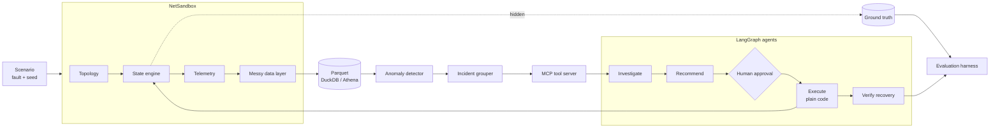
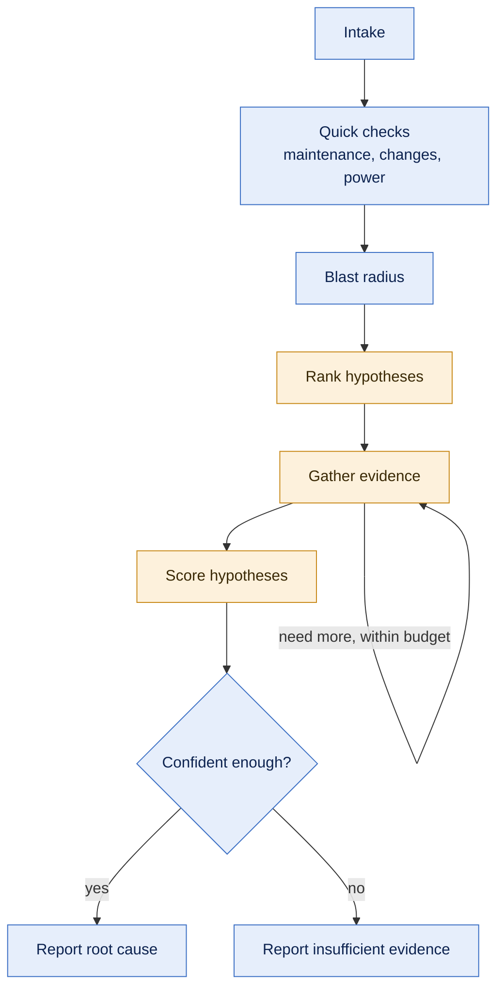
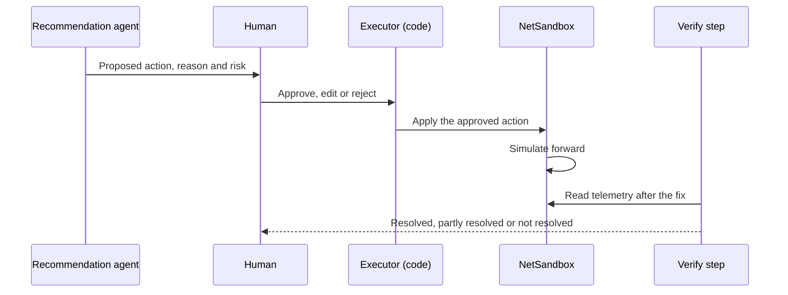

<div align="center">

# NetSleuth

**AI agents that work out why a cable network broke, propose the fix, and prove it worked. All of it is tested against a simulated network where I know the right answer.**


[The problem](#the-problem) · [Why it's hard](#why-its-harder-than-it-looks) · [What I'm building](#what-im-building) · [The agents](#inside-the-agents) · [Proving it works](#proving-it-works) · [Progress](#progress) · [Full design](docs/proposal-v2.md)

</div>

---

## The problem

It's 2:14 a.m. In one neighborhood, 312 cable modems stop responding at the same moment. Within a minute the monitoring system has fired dozens of alerts: modems timing out, signal quality dropping on nearby channels, a fiber node reporting odd optical levels.

The on-call engineer now has to answer four questions fast:

1. **What actually broke?** An amplifier, a fiber cut, a dead power supply, or a bad config push?
2. **How far does it spread?** One street, or three nodes sharing a damaged fiber route?
3. **Is it even real?** Maybe it's planned maintenance nobody flagged, or a utility blackout where the homes are dark but the network is fine.
4. **What do I send?** A tech to one amplifier, a fiber crew, a generator, or a config rollback?

Get it wrong and a truck rolls to the wrong place while thousands of customers stay offline. Cable operators are adding telemetry to every device in their networks, so the data to answer these questions is there. What's missing is something that can read it the way a good engineer does, at 2 a.m., every time.

**NetSleuth is built to do that.** LangGraph agents take an incident, investigate it through tools, write up a root cause with evidence, propose a fix, wait for a person to approve it, apply it, and check that the network actually recovered.

## Why it's harder than it looks

Pointing an LLM at a pile of alerts is easy. Building something an operations team would trust is not. These are the problems that make this project interesting to me, and each one shapes the design.

**Dead devices don't complain. They go quiet.** Cable monitoring data travels over the same network it's watching. When an amplifier dies, every modem behind it stops reporting. The strongest clue is often *missing* data, and the agent has to reason about which part of the tree fell silent together.

**Half the alarms are decoys.** Planned maintenance looks like an outage. A utility power cut darkens homes while the plant is fine. Congestion at a peering point makes one service slow everywhere. An agent that dispatches a truck for each of these costs real money, so decoy handling gets scored as seriously as catching real faults.

**One fault, fifty alerts.** A single fiber cut can take down several nodes at once. If the agent treats every alert separately, it ends up chasing symptoms. Alerts get grouped into incidents first, and scoring happens per incident.

**Good evaluation needs a known answer.** Outage tickets record what was done, not always what truly caused the problem. To measure accuracy precisely, I generate incidents where the root cause is known exactly.

**Remediation deserves a proper test bench.** Recommending a fix is only half the job. The other half is showing the network recovered afterwards. A simulator lets the agents apply real actions, see the consequences, and iterate quickly, which is the same staged path any network change takes before it reaches production.

## What I'm building

Three pieces that work together.

**1. NetSandbox, a cable network simulator.** It models a hybrid fiber coax (HFC) network from hub to CMTS to fiber nodes, amplifiers and a few thousand modems. It runs forward in five minute steps and produces the telemetry a real operations team would see, including the messy parts: late data, duplicate rows, inventory records that don't match reality, and devices that go silent when their parent fails. I inject faults with a known answer, and when an agent applies a fix, the simulator shows whether it worked.

**2. The agents.** An investigation agent finds the root cause and its location. A recommendation agent picks a fix from a runbook. A person approves it, plain code applies it, and a verify step checks the network afterwards.

**3. An evaluation harness.** It scores every run against the hidden ground truth, and it runs the same cases through a hand written rules engine and a single LLM prompt so the agent always has something serious to beat.



The ground truth is written somewhere the agents can't reach. Only the evaluation harness reads it.

### What a finished investigation looks like

This is the report format the investigation agent produces. The values below illustrate the target format.

```json
{
  "incident_id": "inc-0142",
  "root_cause_category": "amplifier_failure",
  "root_cause_device_id": "amp-hub1-node03-a2",
  "confidence": 0.84,
  "affected_device_ids": ["mdm-000418", "mdm-000419", "..."],
  "evidence": [
    {"claim": "All 312 silent modems sit downstream of one amplifier", "source_tool": "blast_radius"},
    {"claim": "Modems on the sibling amplifier are healthy", "source_tool": "get_modem_status"},
    {"claim": "No maintenance window, config change or power event in scope", "source_tool": "prechecks"}
  ],
  "alternatives_ruled_out": [
    {"category": "fiber_cut", "reason": "The node's optical levels are normal and its other branches report fine"},
    {"category": "commercial_power_outage", "reason": "The silent homes span two utility power areas"}
  ],
  "summary": "Amplifier a2 on node 03 has failed. Send a tech to replace it."
}
```

Every piece of evidence points to a tool call that the harness can rerun and check. If the agent can't back up a claim, it's expected to say "insufficient evidence" instead of guessing.

## Inside the agents

### Investigation



Blue steps are plain Python, and orange steps are where the LLM uses judgment. Anything that can be a lookup or a rule stays in code: checking the maintenance calendar, walking the network tree, finding the smallest part of the tree that explains every silent device. The model's job is what code can't do, which is weighing competing explanations against the evidence. That keeps runs cheaper, faster, and much easier to debug in LangSmith. Evidence gathering has a hard cap on tool calls, so an investigation can't wander.

### Safe remediation



The model proposes, a person approves, and ordinary code carries out the action. Success is measured by the network itself: the loop only counts as resolved when the telemetry shows recovery. Keeping judgment, approval and execution in separate hands is what makes an agent like this ready for production conversations.

## Proving it works

An agent is only as credible as the way it's measured. I designed the evaluation up front so the numbers stand on their own.

**Two real baselines.** Every results table shows the agent next to a hand written rules engine and a single LLM prompt with the same context. Comparing against a strong rules engine shows exactly where the agent adds value. Rules handle textbook faults well, and the agent is built for the cases where rules run out: messy data, two faults at once, fault types it has never seen, and explaining its reasoning to a human.

**Sealed test sets.** Scenarios are split four ways. I build against the dev set, CI runs the regression set on every pull request, and the holdout set is opened only at milestones. A novel set of fault types is written by someone else and sealed early, so I never tune for it.

**No peeking at the future.** Every data query is cut off at the moment the incident was detected, enforced in the storage layer. An agent can't solve the case by seeing the recovery.

**Scored by code, not vibes.** Nearly every metric is checked by code against ground truth:

| What I measure | Why it matters |
|---|---|
| Root cause category, per incident | Did it find the right kind of failure? |
| Fault location, with partial credit for being close in the tree | Did the truck go to the right place? |
| Decoy suppression | Did it avoid dispatching crews for maintenance, blackouts and congestion? |
| Abstention | Does it say "I don't know" when it should, and only then? |
| Evidence that holds up on rerun | Is the reasoning real, or just plausible? |
| Closed loop recovery | Did the network actually come back after the fix? |
| Cost, tokens, tool calls and time per incident | Could this actually run in production? |

An LLM judge is used for one thing only: how clear the written report is. I check it against my own labels.

**Predictions on record.** I'm writing down what I expect before the first holdout run, and the final report compares my predictions with what actually happened.

<details>
<summary><b>The faults and decoys the sandbox injects</b></summary>

<br/>

| ID | What happens | The right response |
|---|---|---|
| F1 | An amplifier fails, fully or partly | Send a tech to that amplifier |
| F2 | Noise leaks into the upstream path, on and off | Adjust the modulation profile for quick relief, then send a tech to find the source |
| F3 | A fiber cut takes out one or several nodes on the same route | Send a fiber crew to the route |
| F4 | A plant power supply runs out of battery during a utility outage | Get a generator there before the battery dies |
| F5 | A bad config push hits one CMTS | Roll back the change |
| D1 | Planned maintenance that looks like an outage | Nothing |
| D2 | Peering congestion makes one service slow everywhere | Hand it to the backbone team |
| D3 | A utility power cut darkens homes, but the plant is fine | Keep watching, no truck |

Some scenarios combine two of these at once. The novel fault types are left off this list on purpose.

</details>

## Design choices

| Decision | What I chose | Why |
|---|---|---|
| Source of truth | A simulator I control | Real outages rarely come with a confirmed cause. A simulator gives exact answers to score against. |
| What a dead device reports | Nothing | That's how real cable monitoring behaves, and reasoning about silence is a core skill for the agent. |
| Who applies fixes | Plain code, after human approval | The LLM proposes. It never holds an approval or calls an action directly. |
| Where the LLM is used | Judgment steps only | Lookups and known checks run in code, which makes runs cheaper and reviewable. |
| Data access | Everything goes through MCP | It's how agents plug into live data in production, and other agents can reuse the tools. |
| Storage | DuckDB locally, Athena in the cloud | Same Parquet files behind one interface. The agents can't tell which backend they're on. |
| Scale | A Spark job over a large simulated run | Hundreds of millions of modem rows rolled up into the tables the agents query. |
| Model provider | Anthropic API first, Bedrock second | Fast to start, swappable later through one model interface. |

The full reasoning, including everything I chose to leave out, is in [the design doc](docs/proposal-v2.md).

## Progress

I'm building this in seven weekly milestones, and this section gets updated at the end of each week.

| Week | Milestone | Done when | Status |
|---|---|---|---|
| 0 | Requirements, domain model, evaluation design | [Design doc](docs/proposal-v2.md) published | Done |
| 1 | Simulator core, amplifier failures, DuckDB storage, rules baseline | One command runs a scenario end to end and prints a score | In progress |
| 2 | Investigation agent with LangSmith tracing, holdout sealed | Agent and both baselines scored on the dev set | |
| 3 | MCP server, all faults and decoys, incident grouping, messy data | First holdout numbers | |
| 4 | Recommendation agent and the full approve, apply, verify loop | Closed loop recovery rate reported | |
| 5 | Docker and a CI gate on GitHub Actions | CI blocks a deliberately broken prompt | |
| 6 | Athena backend, Spark at scale, final holdout and novel runs | Final results with confidence intervals | |
| 7 | Evaluation report, failure analysis, demo video | Ready to share | |

Results will go here as soon as there's something real to show, with all three systems side by side.

## Tech stack

| Layer | Tools |
|---|---|
| Agents | LangGraph, Pydantic, Anthropic API, AWS Bedrock |
| Tools | MCP Python SDK, langchain-mcp-adapters |
| Simulator | Python, networkx, numpy, polars |
| Data | Parquet, DuckDB, S3, Athena, boto3, PySpark |
| Quality | pytest, ruff, mypy, LangSmith, GitHub Actions |
| Packaging | Docker, docker compose |

---

<sub>NetSleuth runs entirely on simulated data. It is an independent project and is not modeled on any company's internal systems.</sub>
