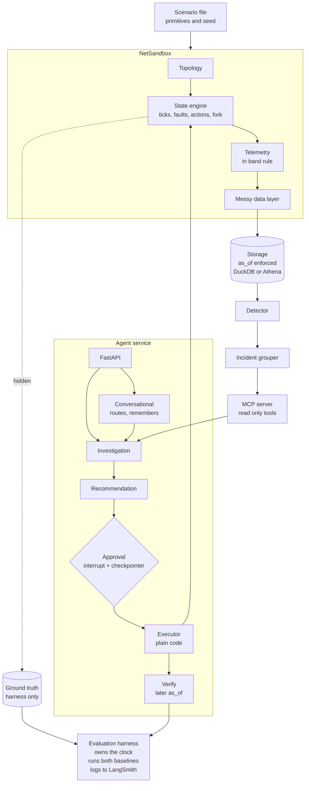
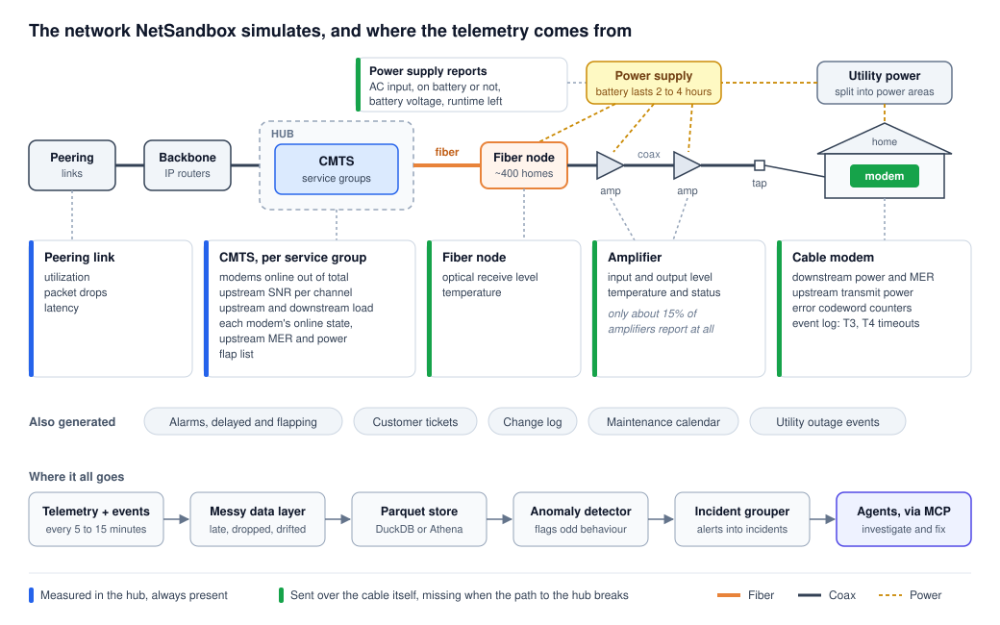

# NetSleuth Design

| | |
|---|---|
| Author | Chandra Prakash Reddy Kalwakolu |
| Date | September 30, 2026 |
| Status | Source of truth for the build. Supersedes [the proposal](proposal-v2.md), which stays as history |
| Repo | https://github.com/Reddy-kalwakolu/NetSleuth-Autonomous-Network-Investigation-Agents |

## Contents

1. [Summary](#1-summary)
2. [Problem](#2-problem)
3. [Goals and non goals](#3-goals-and-non-goals)
4. [Requirements](#4-requirements)
5. [System overview](#5-system-overview)
6. [NetSandbox](#6-netsandbox)
7. [Data layer](#7-data-layer)
8. [Detection and incident grouping](#8-detection-and-incident-grouping)
9. [Tools and MCP](#9-tools-and-mcp)
10. [Agents](#10-agents)
11. [Agent service API](#11-agent-service-api)
12. [Evaluation](#12-evaluation)
13. [Safety boundaries](#13-safety-boundaries)
14. [Engineering](#14-engineering)
15. [Scope and milestones](#15-scope-and-milestones)
16. [Risks](#16-risks)
17. [Decision log](#17-decision-log)
18. [Open questions](#18-open-questions)

## 1. Summary

NetSleuth is a set of AI agents that investigate outages in a cable network, recommend a fix, and confirm the network recovered after a person approves the fix. The agents are built and tested against NetSandbox, a simulator of a hybrid fiber coax (HFC) network that I wrote for this project. The simulator produces realistic, messy telemetry, injects faults whose true cause is known, and applies repair actions so their effect can be measured.

Every result is scored by code against that hidden answer, next to two baselines: a hand written rules engine and a single LLM prompt with the same context.

The design rests on four ideas:

1. **A network I control is the source of truth.** Real outages rarely come with a confirmed root cause, so I generate incidents where the cause is known exactly.
2. **Dead devices go silent.** Monitoring data travels over the network it monitors, so the simulator sends nothing from unreachable devices, and the agent has to reason about missing data.
3. **Code does the lookups, the model makes the judgment calls.** Every step that can be a rule or a query is plain Python. The LLM weighs competing explanations.
4. **The model proposes, a person approves, code applies.** No model output can change the network directly.

## 2. Problem

An operations team watching a large, tree shaped access network gets a steady stream of alerts. For each burst, an engineer has to work out what broke, how far the damage spreads, whether it was planned, and what to send. Many alerts are symptoms of one incident, and some look like outages but need no truck at all. The work is slow, and the quality depends on who is on shift.

Agents can take on the first hour of that work. Two things make them hard to build well:

* **No answer key.** Tickets record what was done, not always what caused the problem, so there is nothing reliable to score an agent against.
* **No safe place to act.** A remediation agent has to be tested on actions with real consequences, which can't happen on a live network.

NetSandbox addresses both, and the agents are built and measured on top of it.

## 3. Goals and non goals

**Goals**

* Cover the full agent lifecycle with working code: building, tools, evaluation and deployment.
* Keep agent control flow explicit and reviewable, with the LLM used only for judgment steps.
* Evaluate with metrics checked by code, against strong baselines, on test cases sealed before tuning.
* Close the loop: recommend, approve, apply, verify.
* Present results so engineers, network experts and leadership can all follow them.

**Non goals**

* RF physics, DOCSIS protocol emulation or packet level simulation
* Backbone modeling beyond a few peering links
* Mobile, video, voice and business fiber
* A sophisticated anomaly detection model
* A polished web UI
* Real operator data, or copying any company's internal systems

## 4. Requirements

### 4.1 Functional

**Simulator**

* R1. Generate a seeded topology in three sizes. Fiber routes and power areas cut across the network tree.
* R2. Step the state forward in fixed ticks. Faults are built from small effect primitives. The same scenario and seed always give the same output.
* R3. Follow the in band rule: a device reports only if it has power and its path to the hub is up. Data measured at the CMTS is always available.
* R4. Produce event streams: the modem event log, the CMTS flap list, alarms, tickets, the change log, the maintenance calendar (`maintenance`, one row per window when it is published) and utility power events.
* R5. Add configurable messy data: dropped polls, counter resets, delayed alarms and inventory drift.
* R6. Accept actions. The right action fixes or eases the fault. A wrong one does nothing, or helps only for a while.
* R7. Fork the state at any tick, apply an action, run forward, and write the result under a branched run ID.
* R8. Write the ground truth where tools and agents can't read it.

**Data and tools**

* R9. Store Parquet files behind one storage interface with two backends, DuckDB and Athena.
* R10. Enforce the `as_of` cutoff in the storage layer. Only the harness sets it.
* R11. Run a simple anomaly detector and write `anomaly_events`.
* R12. Group anomalies into incidents with fixed rules, using the stored inventory.
* R13. Serve read only investigation tools over MCP.

**Agents and service**

* R14. An investigation agent that returns a report in a fixed schema with calibrated confidence, or says there isn't enough evidence.
* R15. A recommendation agent that picks a proposed action from a runbook.
* R16. Human approval through LangGraph `interrupt`, persisted by a checkpointer, then a plain code executor.
* R17. A verify step that reads telemetry after the action and reports the outcome.
* R18. A FastAPI service that starts investigations, returns reports, and takes approval decisions.
* R19. A thin conversational agent that routes an engineer's questions to the other agents and tools, and remembers the conversation.

**Evaluation**

* R20. A rules baseline and a single prompt baseline run on the same cases as the agent.
* R21. Metrics checked by code and scored per incident, including a variant with the true incident groups.
* R22. An expert review workflow: a LangSmith annotation queue with a rubric, and agreement between reviewers measured.
* R23. LangSmith datasets and experiments for every prompt and graph version.
* R24. Tiered CI with a regression gate.

### 4.2 Quality

* NF1. Python 3.12 or later, typed throughout with Pydantic models, and checked with ruff, strict mypy and pytest.
* NF2. Reproducible runs through seeded simulation, pinned prompt versions, recorded traces and a uv lock file.
* NF3. LLM and AWS costs together stay under $50 a month.
* NF4. Development works on Windows. Spark runs in Docker.
* NF5. Every new feature passes the scope rule in Section 15.2.

## 5. System overview



There is one engine and one mode. A run steps the simulation forward tick by tick and writes Parquet. For the closed loop, the engine forks its state at the moment of the action, runs forward, and writes under a branched run ID, so the original history stays untouched.

The harness controls time. Investigation and recommendation see data up to the moment the incident was detected. The verify step sees data up to N ticks after the action, on the branched run.

<p align="center">
  
</p>

## 6. NetSandbox

### 6.1 Topology

The topology is a tree, plus two structures that cut across it.

| Device | Parent | Main attributes |
|---|---|---|
| `backbone` | none | the root |
| `peering_link` | backbone | partner, capacity in Gbps |
| `hub` | backbone | region, city |
| `cmts` | hub | vendor, model, architecture, number of line cards |
| `service_group` | cmts | line card, upstream and downstream channels, split (sub, mid or high) |
| `node` | service_group | architecture, homes passed, fiber route, location |
| `amplifier` | node or amplifier | position in cascade, vendor, whether it reports telemetry, location |
| `tap` | node or amplifier | port count (2, 4 or 8), location |
| `modem` | tap | model, firmware, DOCSIS version, customer ID, power area, location |
| `power_supply` | none | battery runtime, the actives it feeds, power area, location |

`Topology` validates every link when it is built. It rejects a missing parent, a parent of the wrong type, duplicate IDs, and an active fed by more than one power supply. It offers `parent`, `children`, `ancestors`, `subtree` and `power_supply_for`, which the engine and tools build on.

**Realism rules**

* Nodes pass 250 to 500 homes. About two thirds of homes have a modem.
* Each node has 2 to 4 amplifier legs, and its deepest cascade is N+2 to N+5.
* About 15% of amplifiers report telemetry.
* Each power supply feeds up to 6 actives (the node and its amplifiers) and has a battery of 120 to 240 minutes.

**Structures that cut across the tree**

* **Fiber routes.** Each hub has several routes, and neighbouring nodes in the tree are assigned to different routes. Every route therefore spans more than one service group and more than one CMTS, so a route cut looks different from a CMTS or configuration problem.
* **Power areas.** Every located device has coordinates in kilometres, local to its hub. Power areas are cells of a 1 km grid. A node's homes spread over several cells, so a utility outage darkens part of one node and part of another.

**Identifiers.** Plant devices get readable IDs that match how field teams name them, such as `node-hub1-03` and `amp-hub1-node03-a2`. Modems get random, MAC style IDs such as `cm-dca554a1d505`, and customer IDs are random too. A modem's ID never reveals where it sits, which matters once inventory drift corrupts some modem to tap links.

**Line cards** are an attribute of the service group, not a separate device. The grouper only needs to know which service groups share a card.

**Sizes**

| Size | Hubs | CMTS per hub | Service groups per CMTS | Nodes | Modems (seed 0) | Build time |
|---|---|---|---|---|---|---|
| `dev` | 1 | 2 | 2 | 8 | 1,978 | 0.04 s |
| `eval` | 2 | 2 | 5 | 20 | 4,948 | 0.10 s |
| `scale` | 4 | 5 | 5 | 200 | 49,406 | 1.0 s |

The topology is exported as two polars tables. `topology_devices` is one wide, typed table with a column for every attribute, null where a type doesn't use it. `topology_edges` holds `contains` edges (parent to child) and `powers` edges (power supply to active). Export fails loudly if a device has an attribute with no matching column.

### 6.2 State engine

One tick is 5 minutes. Each device carries a status (healthy, degraded with a severity, or down) and flags (on battery, unpowered, unreachable).

**Reachability** is recalculated every tick. A device is reachable only if it and every active on its path to the hub are up and powered. An active is powered if its power supply has utility power or battery left. A modem is powered if its home's power area has utility power.

**Effect primitives** are the only way scenarios change the network:

| Primitive | Effect |
|---|---|
| `take_down(device)` | The device goes down |
| `restore(device)` | The device comes back up, and the modems behind it reboot |
| `degrade_levels(scope, ds_db, us_db)` | Shifts signal levels in a scope |
| `add_us_noise(service_group, snr_drop_db, start_hour, end_hour)` | Upstream noise every day between two local hours. A window can wrap midnight |
| `cut_fiber_route(route)` | Every node on the route loses its fiber link |
| `utility_outage(power_area, duration)` | Homes and power supplies in the area lose utility power |
| `config_change(target, effect)` | A change log entry plus its effect |
| `counter_rate(scope, corrected, uncorrectable)` | Codeword error rates |
| `maintenance_window(window_id, scope, start, end)` | Publishes planned work to the maintenance calendar. The work itself is a `take_down` and a `restore` |
| `peering_load(link, profile)` | Load on a peering link |

A fault is a named bundle of primitives plus its ground truth: category, root device, the level it is graded at, incident ID and correct action. Because faults are built from primitives, someone else can write sealed scenarios without touching Python.

**Scenario files** are YAML: a case ID, the network size and seeds, the run length, and the faults to inject. A fault is one of five kinds: `amplifier_failure`, `fiber_cut` (a route or one node), `ingress_noise`, `planned_maintenance`, or `custom`, which lists primitives directly together with its answer: category, root device, graded level and correct action. `custom` is how someone else can write sealed scenarios without touching Python. Every scenario is built and checked when it loads, so a typo or a device of the wrong kind fails before the run starts. `netsleuth run` runs any set of scenario files end to end and prints their scores.

**Actions** the engine accepts: `dispatch_tech(target, work_type)`, `dispatch_generator(power_supply)`, `rollback_change(change_id)`, `change_modulation_profile(service_group, profile)`, `reset_modems(scope)`, `route_to_team(team)`, `open_capacity_ticket(node)`, `monitor` and `no_action`. The right action fixes the fault after a realistic delay. A wrong one does nothing, or helps only for a while.

**Forking** copies the full state and the random generator, so a branch is exactly reproducible.

### 6.3 Telemetry

**The in band rule.** Modems, amplifiers, node transponders and power supply transponders report only while reachable. Otherwise their rows are simply missing. Data measured at the CMTS is always present, because the CMTS sits in the hub.

| Source | Always present | Metrics |
|---|---|---|
| Modem, as seen by the CMTS | yes | online state, upstream receive power, upstream MER per modem |
| Modem, polled over the plant | no | downstream power and MER, upstream transmit power, cumulative corrected and uncorrectable codeword counters |
| Modem event log (`cm_events`) | no | T3 timeouts, which climb as the service group's low channels get noisy, and T4 when a modem comes back after an outage. A modem that comes back has rebooted, so its counters restart |
| Service group channels | yes | upstream SNR per channel (ingress hits the two lowest channels fully and the rest by a quarter), cumulative uncorrectable upstream codewords per channel, upstream and downstream utilization, modems online and total |
| Fiber node | no | optical receive level, temperature |
| Amplifier (the 15% that report) | no | input and output level, temperature, status |
| Power supply transponder | no | AC input, on battery, battery voltage, runtime left |
| Peering link | yes | utilization, drops, latency |

CMTS and service group data arrive every 5 minutes, and modem RF every 15 minutes (every 5 in the `scale` run, about 430 million modem rows over 30 days). Each value is a baseline plus a daily pattern plus noise plus the fault's effect. Counters only go up, except on reboot.

**Event streams:** alarms with delays and flapping, tickets from customer impact (not every affected customer calls, some calls are unrelated, and people without power at home rarely call right away), the change log, the maintenance calendar and utility power events.

### 6.4 Messy data

Set per scenario: 1 to 3% dropped polls, counter resets without a reboot, delayed alarms, and inventory drift on 1 to 2% of modem to tap links plus some fiber route labels. Drift changes the stored inventory only. The simulator always runs on the true topology.

### 6.5 Faults and decoys

| ID | What happens | What the data shows | Graded at | Right action |
|---|---|---|---|---|
| F1 | Amplifier fails, fully or partly | Full: modems behind it go offline and their RF data disappears, while modems earlier in the cascade are fine. Partial: downstream power drops and upstream transmit power rises behind it | The amplifier, with partial credit by tree distance | `dispatch_tech(amp, amp_repair)` |
| F2 | Intermittent ingress noise | Upstream SNR falls on low channels, uncorrectable codewords and T3 timeouts rise across the group, downstream stays healthy | The node or service group | `change_modulation_profile`, then `dispatch_tech(node, ingress_sweep)` |
| F3 | Fiber cut on a node or a route | Every modem on the affected nodes goes offline at once and node telemetry goes quiet | The route or node | `dispatch_tech(route, fiber_repair)` |
| F4 | Power supply battery runs out | A utility outage, the supply on battery, then its actives go down, taking out modems even outside the outage area | The power supply, and the timing | `dispatch_generator(ps)` before the battery dies |
| F5 | Bad configuration push | Several nodes on one CMTS or line card degrade right after a change log entry | The CMTS or service group, plus the change ID | `rollback_change(change_id)` |
| D1 | Planned maintenance | Looks like an outage inside a scheduled window | The node | `no_action` |
| D2 | Peering congestion | Slow service tickets across unrelated nodes at evening peak, healthy RF, a peering link near 100% | The peering link | `route_to_team(backbone)` |
| D3 | Utility outage, plant fine | Modems go offline following the power area, not the tree. Supplies on battery but not drained | The power area | `monitor` |
| D4 | Service group congestion (Tier 2) | Evening utilization above 80%, latency tickets, healthy RF | The service group or node | `open_capacity_ticket(node)` |
| N | Novel faults | Sealed, written by someone else | | Often "not enough evidence, escalate" |

Some scenarios combine two faults, or a fault and a decoy. A D3 outage becomes F4 if it outlasts the batteries, which is the key time sensitive case.

### 6.6 Ground truth

The engine writes one JSON file per run to `ground_truth/<run_id>.json`: each fault's category, root device, graded level, incident ID, correct action and timing. In docker compose, only the harness container mounts the `ground_truth` volume. The MCP server and agent service can't see it at all.

## 7. Data layer

### 7.1 Layout

```text
data/<run_id>/<table>/dt=YYYY-MM-DD/part-*.parquet
data/<run_id>__b<k>/...        branched runs
```

polars writes the Parquet files. The main tables are `topology_devices`, `topology_edges`, `cm_status`, `cm_rf`, `cm_events`, `flap_list`, `sg_channels`, `sg_status`, `node_optical`, `amp_telemetry`, `ps_status`, `peering`, `alarms`, `tickets`, `change_log`, `maintenance`, `power_events`, `anomaly_events` and `incidents`, plus the hourly node summaries from Spark.

### 7.2 Storage interface and the time cutoff

One `Storage` interface has two backends: DuckDB (the default, used for development and evaluation) and Athena (with explicit table definitions and partition projection). Both use one shared subset of SQL, and all SQL lives inside the tools. Agents never write SQL.

A storage session is created with a run ID and an `as_of` time, and every query it runs is filtered to rows at or before `as_of`. Only the harness creates sessions. In the DuckDB backend the cutoff has three layers:

1. **Views.** Each session gets one view per table. Timed tables are filtered to `ts <= as_of` inside the view, so any query that names a table only sees data from before the cutoff.
2. **Lock.** The session's connection may read only its own run's folder, and the setting is locked. It can't reach the ground truth, another run, or anything else on disk.
3. **Guard.** `query` accepts a single SELECT or WITH statement and rejects anything that reads files directly, which is the only remaining way to reach rows past the cutoff inside the run's folder.

A leakage test checks every table at several cutoffs, including rows exactly at `as_of`. Results come back as polars frames in UTC, through pyarrow.

### 7.3 Spark

A PySpark job rolls the `scale` run up into hourly summaries per node: share offline, T3 and T4 rates, RF percentiles and codeword increases. It runs in Docker on a Java 17 image, because PySpark 4 requires Java 17 or later. The raw data is generated with numpy and polars, and Spark only aggregates it.

## 8. Detection and incident grouping

The detector is deliberately simple, and it grows one signal at a time. Each hit becomes a row in `anomaly_events`, and its misses and false alarms are useful test material.

Every signal shares one onset rule: a condition raises one anomaly when it starts, not one per tick while it lasts.

**Share offline per node.** It reads the CMTS view, which is always present, and finds each modem's node from the stored inventory with a recursive query. A node is flagged when its share offline rises at least 2 points above its own median over the last hour and at least 5 modems are down. A lasting outage raises one anomaly at its onset. Because the median catches up with a standing outage, a second failure on an already dark node still raises a fresh anomaly.

**Upstream SNR per service group.** The lowest SNR across the two low channels, against its own median over the last hour. A drop of 4 dB or more is flagged. It is measured at the CMTS, so it is always present, and it is the clearest sign of ingress.

**T3 rate per node.** The share of a node's modems that logged a T3 timeout in the last hour. It is flagged at 5% or more, and at least 3 points above its own recent median. The event log travels in band, so this goes quiet during a full outage and matters most for intermittent noise. The hourly window is what catches mild ingress, where only about 2% of modems log a T3 in any one tick.

**RF level drop per node.** Each modem's downstream power against the median of its own previous polls (two polls are enough, so a failure in the first hour of a run is still caught). A node is flagged when at least 5 modems and 2% of those polled fell 4 dB or more. This is how a partial amplifier failure shows up, since nothing goes offline.

**Still to come.** Utilization, ticket volume per area, and peering utilization and latency follow with the faults that need them.

The grouper uses fixed rules on the stored inventory. Anomalies close in time are merged when they share a fiber route, power area, CMTS line card, or a CMTS with a recent change. Each incident records its anomalies, the reason for grouping and the detection time. Because it uses the stored inventory, inventory drift can mislead it, just as it would in production.

## 9. Tools and MCP

All tools are read only, and each returns a short summary plus a `query_ref` handle so the agent can drill down and I can rerun any evidence later.

| Tool | Answers |
|---|---|
| `get_incident`, `get_anomaly` | Which anomalies were grouped, and why |
| `get_device`, `get_ancestors`, `get_subtree` | Where a device sits and what hangs off it |
| `find_devices(attr, value, scope)` | Everything sharing a fiber route, power area, modem model or firmware, or line card |
| `summarize_modem_health(scope, start, end)` | Offline, missing and stale counts, the worst devices, a before and during comparison |
| `get_metric_series(device_id, metric, start, end, resolution)` | A time series. Counters come back as increases |
| `get_cm_events`, `get_flap_list`, `get_alarms` | Modem events, unstable modems, alarms |
| `get_recent_changes`, `get_maintenance_windows` | Changes and planned work |
| `get_tickets`, `get_power_events`, `get_power_supply_status` | Customer impact, utility outages, battery state |
| `get_peering_status`, `get_sg_utilization` | Capacity |

The tools are plain Python functions first (milestone 2), then wrapped by an MCP server (milestone 3). Each one takes the storage session and its own arguments, and returns a short summary, the data behind it, and a `query_ref` that reruns it exactly. Built so far: `get_anomaly`, `get_device`, `get_ancestors`, `get_subtree`, `find_devices` (by fiber route, power area, model, firmware or line card), `summarize_modem_health` (on a device or a whole fiber route, including modems that went silent), `get_metric_series` (which reports how long a device has been silent), `get_cm_events`, `get_service_group_health` and `get_maintenance_windows`. The rest wait for their data: `get_flap_list`, `get_alarms`, `get_recent_changes`, `get_tickets`, `get_power_events`, `get_power_supply_status` and `get_peering_status`. The graph reaches them through `langchain-mcp-adapters`:

* **stdio** in tests and local runs, where the agent starts the server as a subprocess.
* **Streamable HTTP** in docker compose, where the server runs in its own container.

The run ID and `as_of` are set on the MCP connection by whoever opens it: the harness during evaluation, or the agent service from the incident's detection time. They never appear in any tool's arguments, so the model has no way to change them. `apply_action` is not a tool.

## 10. Agents

Every agent is a LangGraph graph with typed Pydantic state, versioned prompts in `netsleuth/agents/prompts/`, and hard limits on every loop.

### 10.1 Model layer

Models come through LangChain chat models, chosen by config. The main model is an OpenAI GPT model through `ChatOpenAI`, and `ChatAnthropic` and `ChatBedrockConverse` (the AWS native path) stay configured as backends I can switch to. Typed outputs use `with_structured_output` with Pydantic schemas, and prompt caching is used where the provider supports it. Switching providers is a config change, not a code change. Whichever model runs the final holdout and novel sets is fixed for those runs and named in the evaluation report, because scores from different models are not comparable.

Every LLM call goes through one small interface, `StructuredLLM`, which asks for a typed answer and counts tokens. `LangChainLLM` wraps the configured chat model for real runs and turns any provider failure into one error type. `ScriptedLLM` answers from a function for tests and CI, so no test ever calls a paid API. API keys only ever come from environment variables.

### 10.2 Investigation agent

| Step | Done by | What it does |
|---|---|---|
| `intake` | code | Loads the incident and sets scope and time window |
| `prechecks` | code | Maintenance windows, recent changes, power events, peering and service group load |
| `blast_radius` | code | Affected devices, their lowest common ancestor, and groupings by fiber route, power area and modem model, with a summary of missing data |
| `hypothesize` | LLM | Ranks candidate causes, including unknown |
| `gather_evidence` | LLM picks, code runs | Checks from each hypothesis's playbook, capped at N tool calls |
| `score` | LLM, structured | Scores each hypothesis against evidence, using features computed in code |
| `decide` | code | Top hypothesis, or "not enough evidence" below the calibrated threshold |
| `report` | code, with an LLM summary | A report in the fixed schema |

```json
{
  "incident_id": "inc-0142",
  "root_cause_category": "amplifier_failure",
  "root_cause_device_id": "amp-hub1-node03-a2",
  "confidence": 0.84,
  "affected_device_ids": ["cm-dca554a1d505", "..."],
  "evidence": [{"claim": "...", "source_tool": "blast_radius", "query_ref": "..."}],
  "alternatives_ruled_out": [{"category": "fiber_cut", "reason": "..."}],
  "summary": "..."
}
```

Categories: `amplifier_failure`, `ingress_noise`, `fiber_cut`, `power_supply_failure`, `config_change`, `planned_maintenance`, `peering_congestion`, `commercial_power_outage`, `capacity_congestion`, `unknown` and `insufficient_evidence`.

Confidence is calibrated on dev results with a reliability plot. It is not the model's own guess.

**Version 1 (milestone 2).** The prechecks and blast radius run as one code step, shared with the single prompt baseline so both see the same facts. Decide and report run as one code step, because decide has no branch of its own yet. The checks the model can pick come from a playbook per suspected cause, defined in code. A device the model names is kept only if it is in the stored inventory or is a fiber route, and evidence is kept only if it cites a fact the agent actually saw. Until calibration lands in milestone 5, confidence is the model's own score, compared with `confidence_threshold` from the settings, and the tool call cap is `max_tool_calls`. Prompts live in versioned folders, and every report records its prompt version. If an LLM call or a tool fails, that diagnosis comes back as insufficient evidence with the reason, and the evaluation carries on.

**Prompt version 2.** The first dev run with `gpt-5.4-mini` missed three cases that the facts already answered. On the route cut the blast radius listed three dark nodes on the same route, but the model read it as a power outage and, since power has no playbook, ran no checks. On the node cut it called an amplifier when the whole node was dark. The modem summary also contradicted itself at onset, because RF is polled less often than status, and no fact ever named the amplifier behind a partial failure, where nothing goes offline. Version 2 explains what each fact means (silence against degradation, the dark root and its type, dark route peers, the age of the RF poll, the device above every weakened modem, and the fact that no power data exists yet) without telling the model which answer goes with which pattern, so the agent still has to do the reading. In code, a hypothesis with no playbook now gets general checks instead of none, so every investigation makes at least one gather call, and a device the model names is kept only if it is real and appears, as a whole ID, in the facts it was shown. The single prompt baseline follows the same rule. `prompt_version` selects the folder, so version 1 stays runnable for comparison.

On the dev set with `gpt-5.4-mini`, version 2 raised the agent's location score from 0.70 to 0.90 but dropped its category score from 0.80 to 0.70, and moved the single prompt from 0.80 and 0.78 to 0.80 and 0.88. The traces showed why the agent lost category: the score step was told that a cause no fact can confirm scores low, and since a fiber cut only shows as silence, it answered `unknown` on both cuts while naming the right place. Version 3 removes that line.

**Prompt version 3.** Version 3 drops that line, says that `unknown` means a fault none of the other causes fits rather than a way to say I am unsure, and says that fiber and plant equipment show their failure only as silence. On the same dev set:

| System | Category | Location | Cost per incident |
|---|---|---|---|
| Rules | 1.00 | 0.97 | free |
| Single prompt v1 | 0.80 | 0.78 | $0.0014 |
| Single prompt v3 | 0.80 | 0.97 | $0.0019 |
| Agent v1 | 0.80 | 0.70 | $0.0079 |
| Agent v2 | 0.70 | 0.90 | $0.0100 |
| Agent v3 | 0.80 | 0.95 | $0.0110 |

Both LLM systems still call the node cut `unknown` and the partial amplifier `ingress_noise`, each at the right device. On these ten faults the agent does not beat the single prompt, which costs a sixth as much. Ten faults are too few to tune against any further, so I stop prompt work here and let the holdout set in milestone 2c decide whether the graph earns its cost.

### 10.3 Recommendation agent

Maps the report to candidate actions from a runbook table, where each row has the action, preconditions, risk level and typical time to effect. The model picks one and explains why. The output is a `ProposedAction` with action, target, parameters, reasoning, risk and expected outcome. Only low risk actions, such as `monitor` and `route_to_team`, can skip approval.

### 10.4 Approval, execution and verification

1. **Pause.** The graph calls `interrupt` with the proposed action. A SQLite checkpointer (`langgraph-checkpoint-sqlite`) saves the graph state, so a paused run survives a restart.
2. **Decide.** A person approves, edits or rejects the action through the agent service API, which resumes the graph. During evaluation, a scripted approver with a fixed policy does this instead.
3. **Apply.** The executor is plain code. It checks the approved action against the runbook, calls the sandbox, then forks and runs the simulation forward.
4. **Verify.** A code step reads telemetry at a later `as_of` on the branched run and reports resolved, partly resolved or not resolved. If nothing was fixed, the agent investigates once more or escalates.

### 10.5 Conversational agent

A thin front door for an operations engineer. It is a small LangGraph graph with three steps:

| Step | Done by | What it does |
|---|---|---|
| `route` | LLM, structured | Classifies the question: start or check an investigation, explain a report, list pending actions, or look something up |
| `act` | code | Calls the matching path: the investigation graph, a stored report, the pending action queue, or a read only MCP tool |
| `answer` | LLM | Writes the reply from what `act` returned, citing report fields and `query_ref` handles |

**Memory.** The conversation's messages live in the graph state, saved by the same SQLite checkpointer, so a follow up like "why not a fiber cut?" resolves against the report already discussed. The agent can't approve actions. It only points to the approval endpoint.

**Evaluation.** A fixed set of scripted conversations checks routing accuracy and whether each answer cites the right report fields, all checked by code.

### 10.6 Stretch agent

A data lake exploration agent turns questions into SQL over Athena, restricted to SELECT on approved tables with a row limit, a timeout and validation before running.

## 11. Agent service API

A thin FastAPI service is the entry point for people and for a gateway in front of it.

| Method and path | Purpose |
|---|---|
| `POST /investigations` | Start an investigation for an incident. Returns a thread ID |
| `GET /investigations/{thread_id}` | Status, the report once ready, and any pending action |
| `POST /investigations/{thread_id}/decision` | Approve, edit or reject the pending action, with an optional note. Resumes the graph |
| `POST /conversations/{thread_id}/messages` | Send a message to the conversational agent. A new thread ID starts a new conversation |
| `GET /health` | Liveness |

The request body names the incident, never a time. The service derives `as_of` from the incident's detection time. Each thread ID maps to one LangGraph checkpoint thread.

## 12. Evaluation

### 12.1 Cases and splits

Each case is a scenario template plus a seed and a position in the topology, and its ground truth is generated automatically.

| Split | Share | Used |
|---|---|---|
| dev | about 55% | Any time while building |
| regression | about 15% | The CI gate on pull requests |
| holdout | about 20% | Only at milestones, about three times in total |
| novel | about 10% | Final runs only, written by someone else using the primitives |

The target is at least 60 cases by week 3, growing toward 100. The holdout and novel sets are sealed in week 2, before tuning starts.

**Sealing (milestone 2c).** The holdout set has 12 cases and the novel set 6. A separate AI session wrote them, seeing only section 6 of this document, the scenario format and the simulator code: never the agents, prompts, rules, dev cases or any results. It checked that every fault is detected and reported back only file names and counts, and I committed the files without opening them. Writing them, it found two bugs of mine: a custom fault graded above node level crashed the harness, and an answer outside the device tree, such as a power supply, would have crashed scoring. I fixed both against my own test cases, then ran the sealed sets with everything but the exit code and the detection counts thrown away: 21 faults, all detected. `scenarios/SEALED.sha256` records a digest of each file, and a test fails if a sealed file is edited, added or removed. Digests ignore line endings, so Windows and the Linux CI runner agree. One round of prompt tuning on dev came before sealing, and it could not have seen these cases. The dev set has 20 cases and 23 faults, on the dev network and on a larger two hub network, including two cases with two faults each.

### 12.2 Baselines

* **Rules engine:** plain decision logic over the same data, built to be strong and frozen after the first holdout run. It checks, in this order: an active maintenance window on the node (planned maintenance); for an outage, the rule field engineers use, finding the highest device whose entire downstream is dark from the lowest common ancestor of the offline modems, and calling a route cut when another node on the same fiber route is fully dark too; for upstream noise, ingress at the node with the most modems logging T3 timeouts in the last hour; and for an RF level drop, the outage rule applied to the modems whose power fell, which pins a partial amplifier failure. It has one known blind spot. If an amplifier has no taps of its own and feeds only one other amplifier, a failure of the second looks exactly like a failure of the first, and the rules blame the first. That pattern shows up in about one amplifier in 65, in roughly one network in seven.
* **Single prompt:** one LLM call with the same prefetched context and no graph. It gets the prechecks, the blast radius, and the result of every playbook check, so it sees at least everything the agent could reach.

Every results table shows the agent next to both.

### 12.3 Predictions on record

Before the first holdout run, I record my expectations: rules should match or beat the agent on clean, single, known faults. The agent should do better on messy data, overlapping faults, novel faults (by abstaining) and explanation quality. The final report compares these with what happened. If the evidence supports it, the recommended production design is a hybrid where the rules become tools the agent can call, reported as a separate system.

### 12.4 Metrics checked by code

* Incident grouping: pairwise precision and recall
* Root cause category accuracy, per incident
* Localization: exact match at the graded level, with credit falling by 0.25 per hop in the tree, so one hop off earns 0.75 and four or more hops earn nothing. A fiber route is not in the tree, so route faults earn 1.0 for the route and 0.5 for a node on it
* Matching faults to anomalies: until the grouper exists, a fault claims every anomaly on the nodes it sits on or spans, and on every node in their service groups, from its start until its effects end (a maintenance window's end) or the next fault there starts, whichever comes first. A fault starts when it first shows: an evening ingress fault scheduled at midnight starts at 17:00. The earliest claimed anomaly is diagnosed, and claimed anomalies never count as false alarms
* The same metrics given the true incident groups, to separate grouping errors from agent errors
* Decoy suppression
* Abstention on novel faults, and unnecessary abstention on known ones
* Evidence faithfulness: every `query_ref` is rerun and every claim checked
* Recommendation correctness, and timing for F4
* Closed loop outcome
* Calibration: reliability plot and expected calibration error
* Efficiency: tool calls, tokens, time and cost per incident

Cases from the same template are related, so confidence intervals are bootstrapped by template. Results are broken down by fault type and split, and versions are compared case by case.

An LLM judge rates one thing only: how clear and useful a report is to an operations engineer, against a rubric. I hand label about 20 reports and report the agreement rate.

**Expert review workflow.** Reports and their evidence go into a LangSmith annotation queue with a written rubric: is the root cause right, is the location right, does the evidence support it, and would an engineer act on it. At least two reviewers label a shared sample, ideally me and a network engineer, and I report agreement between them with Cohen's kappa. Labels the reviewers agree on become gold examples. This is the same workflow a team would use to build gold sets from production incidents, exercised here on sandbox output.

### 12.5 CI tiers

| When | What runs | Gate |
|---|---|---|
| Every push | Lint, types, unit tests, graph routing with a mocked LLM | Must pass |
| Pull request touching agents, prompts or MCP | The regression split, 10 to 15 cases | Fails if two or more previously passing cases fail, or limits are exceeded |
| Nightly or on demand | The full dev split | Report only |
| Milestone tag | Holdout, plus novel at the end | Saved to `eval/reports/` |

Results are cached by graph version, prompt version and case ID. Every evaluation run is traced in LangSmith.

### 12.6 From sandbox to production

A real network has no simulator holding the answer. In production I'd use ticket and truck roll resolution codes as noisy labels, and gold sets reviewed by network experts with a rubric, with agreement between experts measured. The sandbox becomes the gate before release, and expert labeled production samples the check after release.

Business metrics are derived from evaluation results, labeled as simulated: truck rolls avoided, false escalation rate, and time to diagnosis compared with a scripted engineer checking a fixed set of dashboards.

## 13. Safety boundaries

| Boundary | How it is enforced |
|---|---|
| The model can't change the network | No action tool exists. Only the executor applies actions, and only after approval |
| The model can't see the future | Storage sessions filter every query by `as_of`. The run and time live on the connection, never in tool arguments |
| The model can't see the answer | Ground truth sits in a volume only the harness mounts |
| Investigations can't run away | Hard caps on tool calls and loop iterations in every graph |
| Every claim is checkable | Evidence carries `query_ref` handles that the harness reruns |

## 14. Engineering

### 14.1 Stack

| Layer | Choice |
|---|---|
| Language | Python 3.12 or later, Pydantic, pydantic-settings |
| Agents | LangGraph with a SQLite checkpointer, LangChain chat models (OpenAI main, Anthropic and Bedrock switchable), LangSmith |
| Tools | MCP Python SDK, langchain-mcp-adapters |
| Service | FastAPI |
| Simulator | numpy, polars |
| Data | Parquet, DuckDB, S3, Athena, boto3, PySpark |
| Quality | pytest, ruff, strict mypy |
| Packaging | uv with `uv.lock`, Docker, docker compose |
| CI | GitHub Actions |

### 14.2 Configuration

Settings load in three layers, highest priority first: `NETSLEUTH_*` environment variables, a YAML file (passed in, or `netsleuth.yaml` in the working directory), then defaults in code. Unknown keys and invalid values are rejected. Settings cover the simulation (`seed`, `topology_size`, `tick_minutes`), storage (`storage_backend`, `data_dir`, `ground_truth_dir`), the model (`llm_provider`, `llm_model`, and its prices `llm_input_usd_per_mtok` and `llm_output_usd_per_mtok`), the agent (`max_tool_calls`, `confidence_threshold`, `prompt_version`), spend (`max_cost_usd_per_run`) and tracing (`langsmith_project`, `langsmith_tracing`). Keys are never settings: they come only from environment variables.

**Cost.** The harness records each case's LLM calls, tokens and tool calls, prices them from the settings, and stops a run once it has spent `max_cost_usd_per_run`. Every diagnosis runs inside a LangSmith tracing context tagged with the system and the case, and tracing is off unless it is switched on and `LANGSMITH_API_KEY` is set.

### 14.3 Repository layout

```text
netsleuth/
  config.py           settings loading
  sandbox/            the simulator
    topology/         device models, generator, table export
    engine/  telemetry/  mess/  scenarios/
  storage/            DuckDB and Athena backends, as_of sessions
  detector/           detector and incident grouper
  tools/              investigation tools as plain Python
  mcp_server/         MCP wrapper, stdio and Streamable HTTP
  models/             chat model setup from config
  agents/             graphs, versioned prompts
  api/                FastAPI agent service
  baselines/          rules and single prompt
  eval/               harness, cases, metrics, calibration, judge
eval/reports/         saved evaluation reports
scenarios/            dev, regression, holdout, novel
ground_truth/         generated, harness only
spark_jobs/  docker/  tests/  .github/workflows/
```

### 14.4 Containers

Docker images for the sandbox and storage, the MCP server, the FastAPI agent service, and Spark (on Java 17). docker compose runs everything locally. The CI pipeline is plain jobs (lint, test, eval, build), so it moves between CI systems with little work.

### 14.5 Testing approach

Each behaviour gets a failing test before its code. For key behaviours I also break the code on purpose to confirm a test catches it. That practice already caught one weak test in the topology work, where fiber routes aligned with a CMTS still passed. The test now requires every route to span more than one CMTS.

## 15. Scope and milestones

### 15.1 Tiers

**Tier 1, committed:** topology, engine, in band telemetry, event streams and messy data; F1 to F5 and D1 to D3; DuckDB storage with the cutoff and an Athena backend with one demo run; detector and grouper; the MCP server; the FastAPI agent service; the investigation and recommendation agents with approval, execution and verification; a thin conversational agent; the expert review workflow; both baselines, the harness, calibration and LangSmith; scenario files from primitives; Docker and CI with the regression gate; the Spark job over `scale`.

**Tier 2, if on schedule:** the D4 decoy, LLM driven incident grouping, a business metrics section.

**Tier 3, stretch:** the data lake exploration agent, Remote PHY nodes, a one command AWS deploy and teardown.

**Out of scope:** live replay on a wall clock, infrastructure as code and Glue crawlers, clock skew and duplicate tickets, free SQL for the investigation agent, generating the large dataset with Spark, simulated business metrics on their own, service groups shared by several nodes in the `eval` network (the `dev` network keeps two per service group on purpose, D-30), DOCSIS 3.1 OFDM and PNM data, LLM written ticket text, an always on public demo.

### 15.2 Scope rule

Before anything is added: does an agent or the evaluation need this? If not, it goes on the future work list. The simulator gets at most a third of the total time, about 45 hours.

### 15.3 Milestones

Eight milestones, roughly 150 hours in total. Milestones 1 to 6 and 8 are about 20 hours each, and milestone 7 is a short one of about 10 hours.

| # | What gets built | Done when |
|---|---|---|
| 1 | Skeleton, topology, engine with primitives, in band telemetry, DuckDB with the cutoff, a minimal detector, F1, the rules baseline, a minimal harness and 3 to 5 scenarios | `netsleuth run scenarios/dev/f1_*.yaml` runs a scenario and prints a score |
| 2 | F2, F3 and D1, the tools, investigation agent v1, chat model setup, cost per case, LangSmith, the single prompt baseline, about 20 dev cases, basic CI, holdout and novel sealed | Agent and both baselines scored on dev |
| 3 | MCP wrapper, F4, F5, D2 and D3, incident ground truth, grouper and incident scoring, messy data, 60 or more cases, written predictions | First holdout numbers for all three systems |
| 4 | Recommendation agent, `interrupt` with the checkpointer, the FastAPI service, the executor, fork and advance, verify | Closed loop resolution rate reported |
| 5 | Docker and compose, the regression gate, calibration and the abstention threshold, failure analysis from traces | CI blocks a deliberately broken prompt |
| 6 | Athena demo run, the Spark job, one round of improvements, final holdout and novel runs | Final results with confidence intervals |
| 7 | The conversational agent and the expert review workflow | Scripted conversations pass, and reviewer agreement is reported |
| 8 | This design doc updated with results, evaluation report, failure analysis, README and demo video, with about 4 hours of buffer | Ready to share |

If I fall behind, I cut in this order: Tier 3, Tier 2, the Athena demo run (keeping the interface and its test), the Spark job size, the conversational agent, then D2. I don't cut the baselines, the time cutoff, holdout discipline, incident scoring or the closed loop.

## 16. Risks

| Risk | Mitigation |
|---|---|
| I write both the faults and the agent | Two baselines, sealed holdout and novel sets, novel scenarios by someone else, abstention scoring, predictions recorded first |
| The simulator isn't realistic enough | Domain details checked against how cable plants behave, assumptions listed openly, a cable engineer reviews the fault catalog |
| The simulator grows out of control | A 45 hour cap, the scope rule, faults built from shared primitives |
| The evaluation set is small and related | Bootstrapping by template, results per fault type, case by case comparison |
| LLM costs | Measured on October 1, 2026 with `gpt-5.4-mini` on the dev scenarios: about $0.008 per investigation for the agent and $0.0014 for the single prompt, so the $50 monthly cap covers thousands of investigations. Every run is priced and stopped at `max_cost_usd_per_run`; tiered CI and cached results keep repeat runs cheap |
| LangSmith free tier limits | Each investigation is one trace; a full dev run is about 30 traces across the two LLM systems. I watch the monthly count as the case set grows |
| Milestone 1 is dense | Tasks 7 and 8 can move into milestone 2 without changing scope |

## 17. Decision log

| # | Decision | Alternatives considered | Why this one |
|---|---|---|---|
| D-01 | Ground truth comes from a simulator I control | Public outage datasets, labeled tickets | Neither gives a confirmed root cause per incident. A simulator gives exact answers and lets fixes be tested |
| D-02 | Unreachable devices send nothing | Sending bad or zero readings | Real cable monitoring travels in band, so failures show up as silence |
| D-03 | Code for lookups, LLM for judgment | A fully autonomous tool calling agent | Cheaper, faster, reviewable, and easier to debug from traces |
| D-04 | Model proposes, person approves, code applies | Letting the agent call an action tool | No model output can change the network. This is the pattern I'd want in production |
| D-05 | The harness owns the clock, enforced in storage | Trusting tools or prompts to respect time | Makes leakage impossible by construction, and still allows the verify step to look later |
| D-06 | Score incidents, with a rules based grouper in core | Scoring single alerts | One fault can raise many alerts, and alert level scoring rewards the wrong behaviour |
| D-07 | Rules and single prompt baselines on every case | Comparing agent versions only | Shows where the agent adds value, and guards against grading my own homework |
| D-08 | A regression split for CI, holdout only at milestones | Running the holdout in CI | Keeps the holdout from turning into a second dev set |
| D-09 | All data access through read only MCP tools | Direct SQL, or tools bound in code only | Matches how agents connect to live data in production, keeps tools reusable, keeps evidence checkable |
| D-10 | stdio locally, Streamable HTTP in compose | stdio everywhere | stdio can't cross containers |
| D-11 | Parquet with DuckDB locally and Athena in the cloud | Postgres, TimescaleDB | One file format and one SQL subset serve both. DuckDB needs no server, and Athena runs straight off S3 |
| D-12 | numpy and polars generate data, Spark only aggregates | Generating with Spark | Generation is simple and fast in memory. Spark earns its place on the 430 million row aggregation |
| D-13 | Spark in Docker on Java 17 | Local install, WSL2 | PySpark 4 needs Java 17, and the dev machine has Java 11. Docker keeps it isolated |
| D-14 | LangChain chat models for Anthropic and Bedrock | A custom model interface | Already one shared interface, with native LangGraph, LangSmith and structured output support |
| D-15 | SQLite checkpointer | In memory, Postgres | `interrupt` needs a checkpointer. SQLite survives restarts without running a database server |
| D-16 | A thin FastAPI agent service | CLI prompt only, LangGraph's dev server and Studio | Gives the approval step a real interface, and is what a gateway would sit in front of |
| D-17 | Plain parent and child maps for the topology | networkx | Nothing needs graph algorithms. The walks the engine needs are a few lines and fully tested |
| D-18 | Readable plant IDs, random modem IDs | Sequential IDs everywhere | Plant IDs stay readable for people. Random modem IDs don't leak location, which keeps inventory drift meaningful |
| D-19 | Line card as a service group attribute | A separate line card device | The grouper only needs shared card membership, and the tree stays simpler |
| D-20 | uv with a lock file | pip ranges, pip-tools | Identical installs everywhere, which reproducibility depends on, and fast CI |
| D-21 | Anthropic API first, Bedrock second (superseded by D-32) | Bedrock only | Quicker to start. Bedrock keeps an AWS native path open behind the same interface |
| D-22 | A thin conversational agent in the core | Leaving it as a stretch goal | It exercises conversation memory and orchestration across agents, for about 6 hours |
| D-23 | An expert review workflow in the core | A demo only if on schedule | Gold data built with domain experts is how agent quality gets measured in production, so the workflow belongs in the core |
| D-24 | A short eighth milestone for the additions | Absorbing them with zero buffer, or shrinking the Spark job | A solo plan with no buffer tends to force hurried cuts later, and the Spark job stays at full scale |
| D-25 | The data lake exploration agent stays a stretch goal | Moving it into the core | The time goes to memory, orchestration and expert review instead. SQL and Athena are still exercised by the tools and the storage backend |
| D-26 | The DuckDB cutoff is views, a directory lock and a read only guard | Materializing filtered tables per session, locking all file access | Materializing needs too much memory at the `scale` size, and locking all file access also blocks the views, which read files at query time |
| D-27 | The harness lives in `netsleuth/eval`, reports in `eval/reports` | A top level `eval` package | A package named `eval` shadows Python's built in `eval` |
| D-28 | A fault claims every anomaly on its nodes and their service groups until its effects end or the next fault there starts | One anomaly per fault | A route cut darkens four nodes, and scoring one anomaly per fault made the other three look like false alarms. Known limit until the grouper exists: faults with no end (amplifier failures, fiber cuts) claim their whole scope to the end of the run, and a later fault cuts off the whole scope, not just the nodes it shares |
| D-29 | Route faults are graded by route: 1.0 for the route, 0.5 for a node on it | Tree distance | A fiber route has no place in the network tree |
| D-30 | The `dev` network keeps two nodes per service group | One node per service group, as the `eval` network has | Two nodes make upstream noise ambiguous between neighbours, as it is in real plants. Regenerating `dev` would also change every scenario's device IDs |
| D-31 | Counts and events draw from their own random stream | One stream for everything | How many random numbers a Poisson draw uses depends on its rate, so one stream would let a fault shift the noise on every unrelated level after it |
| D-32 | An OpenAI GPT model is the main model, with Anthropic and Bedrock kept as switchable backends | Anthropic first as in D-21, or one provider only | I already have OpenAI API credits, which keeps LLM spend near zero and leaves the monthly budget for AWS. The agent stays model agnostic behind LangChain chat models, and Bedrock keeps the AWS native path |
| D-33 | One `StructuredLLM` interface with a scripted implementation for tests | LangChain's fake chat models | Structured output support in the fake models varies across versions, and a scripted answer makes tests and CI deterministic and free |
| D-34 | The harness meters usage and stops a run at `max_cost_usd_per_run` | Watching spend in the provider's console | A console shows the bill afterwards; only the harness can stop a run before it overspends the monthly budget |
| D-35 | Prompts explain the facts, code keeps names honest | A rule table in the prompt ("dark peers mean a route cut") | A rule table turns the agent into a second rules engine and the comparison stops meaning anything. Explaining the facts keeps the reasoning with the model, and dropping any device it was never shown stops lucky guesses from the naming pattern from counting as location hits |
| D-36 | Sealed sets written by an isolated AI session, committed unread with a digest manifest | Writing them myself, or encrypting them in the repo | I tune the agent, so I can't write its test cases. A session limited to the simulator's spec is the independent author I have, and the manifest makes any later change visible without hiding the files from anyone |

## 18. Open questions

1. **Scenario authors.** Settled in milestone 2c: a separate AI session wrote the holdout and novel sets and I committed them unread (D-36). A person writing extra novel cases before the final runs would still make the result stronger.
2. **Cloud deploy.** The one command AWS deploy and teardown stays in Tier 3 unless milestones 1 to 4 finish early.
3. **Remote PHY.** Stays in Tier 3 on the same condition.
4. **LangSmith plan.** Whether the free tier covers the evaluation volume is confirmed in week 2.
