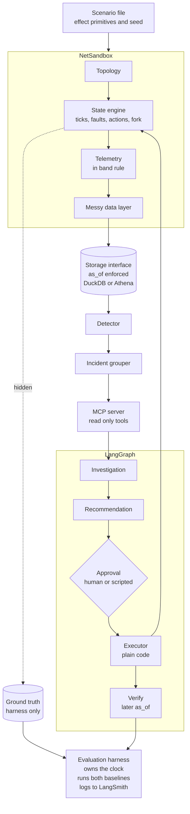

# NetSleuth: Network Operations AI Agents, Evaluated in a Safe Sandbox

| | |
|---|---|
| Author | Chandra Prakash Reddy |
| Version | v2, September 24, 2026. Replaces the v1 "NetSandbox" proposal |
| Status | Direction agreed. Open items are in Section 16 |
| Repo | https://github.com/Reddy-kalwakolu/NetSleuth-Autonomous-Network-Investigation-Agents |

NetSleuth is the whole project. NetSandbox is the simulator inside it, and lives in `netsleuth/sandbox/`.

## Contents

0. [What changed since v1](#0-what-changed-since-v1)
1. [Context](#1-context)
2. [The problem](#2-the-problem)
3. [Goals, non goals and success criteria](#3-goals-non-goals-and-success-criteria)
4. [Requirements](#4-requirements)
5. [Scope tiers](#5-scope-tiers)
6. [Architecture](#6-architecture)
7. [NetSandbox specification](#7-netsandbox-specification)
8. [Faults and decoys](#8-faults-and-decoys)
9. [MCP server](#9-mcp-server)
10. [Agents](#10-agents)
11. [Evaluation](#11-evaluation)
12. [Engineering and deployment](#12-engineering-and-deployment)
13. [Repository layout](#13-repository-layout)
14. [Milestones](#14-milestones)
15. [Risks](#15-risks)
16. [Open items](#16-open-items)

## 0. What changed since v1

After a close review of v1, I made these changes.

| # | Change | Why |
|---|---|---|
| 1 | I added a rules baseline and a single prompt LLM baseline. The agent is always reported next to both. | It answers the obvious question: why use an LLM at all? It also reduces the risk that I'm grading my own homework. |
| 2 | I write down the results I expect before the first holdout run. | It keeps me honest. Rules should win on clean, known faults. The agent should win on messy data, overlapping faults, new fault types, and explanations. |
| 3 | Dead or unreachable devices now send nothing, instead of bad readings. | Cable monitoring data travels over the same plant it monitors. When a device dies, you get silence. |
| 4 | The evaluation harness owns the clock (`as_of`), and the storage layer enforces it. It moves forward in controlled steps for the recovery check. | This stops agents from seeing data from after the incident, without blocking the closed loop. |
| 5 | The agent now proposes an `Action` object. A LangGraph `interrupt` asks a human to approve it, and a plain code step applies it. The LLM never calls `apply_action` and never holds an approval token. | This is how I'd want remediation to work on a real network. |
| 6 | CI runs on its own regression split. The holdout only runs at milestones. | v1 contradicted itself here, and running the holdout in CI would have turned it into a second dev set. |
| 7 | I score incidents, not single alerts, and a simple rule based grouper is part of the core scope. | Fiber route cuts and power outages set off many alerts at once. |
| 8 | I fixed several domain details. Upstream SNR is per CMTS channel. Codeword counts are cumulative counters. T3 and T4 timeouts are events. Fiber routes and power areas cut across the network tree. I added a commercial power outage decoy, and I grade ingress at the node. | A cable engineer would check all of these. |
| 9 | Scenario files are built from small effect primitives, and this moved into the core scope. | Someone else can write holdout and novel scenarios without touching Python. |
| 10 | I cut live replay mode, IaC, Glue crawlers, clock skew, duplicate tickets, and free SQL access for the investigation agent. | Scope. |
| 11 | The plan is now 7 weeks, about 140 hours. | v1 was roughly 40% over budget. |
| 12 | I start on the Anthropic API behind a model interface, with Bedrock as a second backend. | Quicker to get going, and Bedrock keeps an AWS native path open. |
| 13 | I dropped the claim that temperature 0 makes runs deterministic. I now say runs are reproducible through pinned prompts, fixed seeds and recorded traces. | The old claim wasn't true. |

## 1. Context

### 1.1 Why I'm building this

Large cable operators are adding telemetry to every active device in their networks, and they want AI agents that can find the root cause of an anomaly, recommend a fix, and answer questions about operational data in plain language. I want to build that kind of system end to end, and show how I'd engineer and evaluate it so people can trust it.

Until I have real numbers, this plan describes the design and my progress, not results.

### 1.2 What the project has to show

Operations teams in this space usually run a small family of agents: one that investigates incidents, one that recommends fixes, one that explores the data lake, and a conversational front door for network engineers and the NSOC. NetSleuth builds the first two in depth and leaves the other two as stretch goals.

Across all of them, the project covers:

* Building agents in LangGraph with explicit state, control flow, tools and prompts
* Connecting agents to anomaly detection output, a data lake and live tools through MCP
* Shipping through CI/CD with containers
* Supervised evaluation against ground truth, going well beyond LLM as a judge
* Tracing and failure analysis with LangSmith
* Prompt and context engineering
* Reviewable, reproducible control flow with automated tests
* Remediation with a human approving every action
* Spark, AWS S3 and Athena, and SQL for data at scale

### 1.3 Industry background

Cable networks in the US are in the middle of a big upgrade. Operators are moving from traditional integrated CMTS gear to Distributed Access Architecture with Remote PHY and virtual CMTS, and on toward DOCSIS 4.0. Mergers and staggered upgrades leave the combined networks with a mix of architectures, vendors and data formats. At the same time, operators are pushing proactive maintenance: using telemetry to spot and fix problems before customers notice.

That mix is why a sandbox matters. Agents have to cope with messy, uneven data, and nobody wants to test them on a live network first.

## 2. The problem

Network operations teams get a constant stream of alerts from a huge, tree shaped access network. For each one, an engineer has to figure out what actually broke, how far the damage spreads, whether it was planned, and what to do. Many alerts turn out to be symptoms of the same incident. The work is slow and depends a lot on who is on shift.

Agents can take on the first hour of that detective work. Building them runs into two problems, though. You can't safely develop remediation agents on a live network. And you rarely know for certain what the real root cause was, so there's nothing solid to score against.

NetSleuth tackles both:

1. NetSandbox, a simulator of an HFC network. It produces realistic, messy telemetry, injects faults with a hidden true answer, and accepts repair actions.
2. LangGraph agents that investigate incidents, recommend fixes, apply approved actions and check for recovery. I measure them against a rules engine and a single prompt, on scenarios they never saw during development.

In one line: a safe place to test network operations agents before they touch production, plus the agents themselves, measured honestly against a strong rules baseline.

## 3. Goals, non goals and success criteria

### 3.1 Goals

* Cover the whole agent lifecycle with working code: building, tools, evaluation and deployment.
* Keep agent control flow explicit and easy to review. Code does the fetching and the known checks. The LLM makes the judgment calls.
* Evaluate with objective metrics that code can check, and compare against honest baselines.
* Close the loop: recommend, approve, apply, verify.
* Present results so engineers, network experts and leadership can all follow them.

### 3.2 Non goals

* RF physics, DOCSIS protocol emulation or packet level simulation
* Backbone modeling beyond a few peering links
* Mobile, video, voice and business fiber
* A clever anomaly detection model. That's another team's job.
* A polished web UI
* Copying any operator's internal systems or using real operator data

### 3.3 Success criteria

1. One run goes all the way from scenario to telemetry, anomalies, incident, investigation, recommendation, approved action and confirmed recovery.
2. The evaluation set has at least 60 cases, split into dev, regression, holdout and novel.
3. On the holdout, I report the agent, the rules baseline and the single prompt baseline side by side. That covers root cause accuracy per incident, localization accuracy, decoy suppression and abstention quality, with confidence intervals bootstrapped by scenario template.
4. My expected results are written down before the first holdout run, and the final report compares them with what actually happened.
5. CI blocks a deliberately broken prompt using the regression split.
6. Every evaluation run is traced in LangSmith, and I write up at least three failures I diagnosed.
7. A Spark job aggregates a large simulated run (hundreds of millions of modem rows) into the tables the agents query.
8. The finished project includes a design doc, an evaluation report, a README and a 3 to 5 minute demo video.
9. LLM and AWS costs together stay under $50 a month.

## 4. Requirements

### 4.1 What the system must do

**Simulator**

* R1. Generate a seeded topology in three sizes (`dev`, `eval`, `scale`). Each node has a `fiber_route` and each power supply and home has a `power_area`. These don't follow the tree.
* R2. Step the state forward in fixed ticks. Faults are built from small effect primitives. The same scenario and seed always give the same output.
* R3. Follow the in band rule. A device only reports if it has power and its path back to the headend is up. Data measured at the CMTS is always available.
* R4. Produce event streams: the cable modem event log (T3 and T4), the CMTS flap list, alarms, tickets, the change log, the maintenance calendar and utility power events.
* R5. Add configurable mess: dropped polls, counter resets and inventory drift.
* R6. Accept actions. The right action fixes or eases the problem. A wrong one does nothing, or helps only for a while.
* R7. Fork the state at any time T, apply an action, simulate N more ticks, and write the result under a branched run ID.
* R8. Write the ground truth (fault, target, incident IDs, correct action, the level at which the fault can be located) somewhere tools and agents can't read.

**Data and tools**

* R9. Store Parquet files behind one storage interface with two backends: DuckDB (the default, used for evaluation) and Athena.
* R10. Enforce the `as_of` cutoff in the storage layer. The harness sets it. Agents and tools can't change it.
* R11. Run a simple detector over node summaries, ticket volume, and service group and peering utilization, and write `anomaly_events`.
* R12. Group anomalies into incidents using fixed rules: close in time, and sharing a fiber route, power area or CMTS line card, based on the stored inventory.
* R13. Serve read only investigation tools over MCP. Outputs are short summaries with `query_ref` handles for drilling down.

**Agents**

* R14. A Structured Investigation agent in LangGraph that returns a report matching a fixed schema, with a calibrated confidence, or says there isn't enough evidence.
* R15. A Recommendation agent that picks a `ProposedAction` from a runbook table.
* R16. Human approval through `interrupt`, followed by a plain code executor. During evaluation, a scripted approver stands in for the human.
* R17. A verify step that reads telemetry N ticks after the action and reports resolved, partly resolved or not resolved.

**Evaluation**

* R18. A rules baseline and a single prompt baseline run on the same cases as the agent.
* R19. Metrics checked by code (Section 11.4), scored per incident. There's also a variant where the agent is handed the true incident groups.
* R20. LangSmith datasets and experiments for every prompt and graph version.
* R21. Tiered CI with a regression gate (Section 11.7).

### 4.2 Quality requirements

* NF1. Python 3.11 or later, object oriented, typed, with Pydantic models. Checked with ruff, mypy and pytest.
* NF2. Reproducible runs through seeded simulation, pinned prompt versions and recorded traces.
* NF3. Under $50 a month for LLM and AWS together. I measure cost per case in week 2, before scaling up evaluation runs.
* NF4. Development works on Windows. Spark runs in Docker or WSL2.
* NF5. Every new feature has to pass the scope rule in Section 5.4.

### 4.3 Explicitly out of scope

* Live replay on a wall clock. Fork and advance replaces it.
* IaC with Terraform or CDK, and Glue crawlers. I use explicit table definitions with partition projection.
* Clock skew between sources, and duplicate tickets.
* Free SQL access for the investigation agent. That belongs only to the stretch exploration agent.
* Generating the large dataset with Spark. numpy and polars generate it, and Spark aggregates it.
* Business metrics simulated on their own. I derive them from evaluation results and state my assumptions.
* Upstream and downstream service groups of different sizes, or several nodes sharing one service group. I assume one node per service group.
* DOCSIS 3.1 OFDM subcarrier data and PNM pre equalization analysis.
* Ticket text written by an LLM. I use templates with some variation.
* An always on public demo.

## 5. Scope tiers

### 5.1 Tier 1: core

* Topology generator with fiber routes and power areas, a state engine built on effect primitives, and in band telemetry.
* Event streams, plus the messy data layer (dropped polls, counter resets, inventory drift).
* Faults F1 to F5 and decoys D1 to D3.
* DuckDB storage with the `as_of` cutoff, and an Athena backend with one demo run.
* The detector and the rule based incident grouper.
* The MCP server.
* The Investigation agent, and the Recommendation agent with approval, execution and verification.
* The rules baseline, the single prompt baseline, the evaluation harness with incident scoring, calibration and LangSmith.
* Scenario files built from effect primitives.
* Docker and GitHub Actions CI with the regression gate.
* A Spark aggregation job over the `scale` run.

### 5.2 Tier 2: extras, only if I'm on schedule

* D4, a capacity congestion decoy. About 2 hours with primitives.
* LLM driven incident correlation that improves on the rule based grouper. About 8 to 10 hours.
* A business metrics section in the evaluation report, derived from results. About 2 hours.
* A demo of an expert annotation workflow, using a LangSmith annotation queue and a rubric. About 3 hours.

### 5.3 Tier 3: stretch

* A Data Lake Exploration agent that turns questions into SQL over Athena, with guardrails.
* A conversational front door for the NSOC that sits on top of the other agents.
* Remote PHY nodes, about 20% of them, with different node telemetry and a different fiber cut signature.
* A one command AWS deploy and teardown through CI.

### 5.4 Scope rule

Before I add anything, I ask one question: does an agent or the evaluation need this? If not, it goes into the Future work section of the README. The simulator gets at most a third of my total time, which is about 45 hours.

## 6. Architecture



There's one engine and one mode. Every run steps the simulation forward tick by tick and writes Parquet. For the closed loop, the engine forks its state at the moment of the action, moves forward, and writes to a branched run ID. The original history stays untouched.

The evaluation harness controls the `as_of` clock. Investigation and recommendation run with `as_of` set to the moment the incident was detected. The verify step runs with `as_of` set to N ticks after the action, on the branched run. The storage layer drops every row later than `as_of`, and each MCP session is tied to one `as_of`, so no tool can look into the future. A unit test checks that no query ever returns a row past the cutoff.

## 7. NetSandbox specification

### 7.1 Topology

| Device | Main attributes | Parent |
|---|---|---|
| `peering_link` | partner name, capacity in Gbps, location | backbone |
| `hub` | region, city | backbone |
| `cmts` | vendor, model, architecture (integrated or virtual), line cards | hub |
| `service_group` | upstream and downstream channels, split (sub, mid or high) | CMTS line card |
| `node` | architecture (analog, with Remote PHY in Tier 3), homes passed, location, fiber route | service group |
| `amplifier` | position in cascade, vendor, whether it reports telemetry (about 15% do) | node or amplifier |
| `tap` | port count | amplifier or node |
| `modem` | model, firmware, DOCSIS version, customer ID, power area of the home | tap |
| `power_supply` | battery runtime of 120 to 240 minutes, the actives it feeds, power area | geographic area |

Typical values: 250 to 500 homes passed per node, amplifier cascades of N+2 to N+5, and taps with 2 to 8 ports. Several nodes share each fiber route. Power areas overlap the tree without lining up with it.

Sizes:
* `dev`: 1 hub, 2 CMTS, about 8 nodes and 2,000 modems
* `eval`: 2 hubs, about 20 nodes and 5,000 modems
* `scale`: about 50,000 modems

The topology is stored as two tables, `topology_devices` and `topology_edges`. Inventory drift corrupts a small share of modem to tap links, plus a few fiber route labels, in the stored copy only. The simulator itself always uses the true topology.

### 7.2 State engine

One tick is 5 minutes by default. A device can be healthy, degraded (with a severity), or down, and it can carry flags such as on battery, unpowered or unreachable.

Reachability is recalculated every tick from the tree, the fiber routes and power. A device is reachable only if it and every active device on its path to the headend are up and powered.

Scenario files use these effect primitives:

* `take_down(device)`
* `degrade_levels(scope, ds_db, us_db)`
* `add_us_noise(service_group, snr_drop_db, schedule)`
* `cut_fiber_route(route)`
* `utility_outage(power_area, duration)`
* `config_change(cmts or service_group, effect)`
* `counter_rate(scope, corrected, uncorrectable)`
* `maintenance_window(scope, start, end, effect)`
* `peering_load(link, profile)`

A fault is a named bundle of primitives, plus its ground truth: category, root device, the level at which it can be located, incident ID and correct action.

Actions the sandbox accepts:

* `dispatch_tech(target, work_type)`. Fixes the fault after a simulated delay, but only if the target and work type are right.
* `dispatch_generator(power_supply)`
* `rollback_change(change_id)`
* `change_modulation_profile(service_group, profile)`. Eases ingress without fixing it.
* `reset_modems(scope)`. Helps for a while, or not at all.
* `route_to_team(team)`
* `open_capacity_ticket(node)`
* `monitor`, or `no_action`

Forking copies the full state and random number generator, so a branch is exactly reproducible.

### 7.3 Telemetry

**The in band rule.** Modems, amplifiers, node status transponders and power supply transponders only report while they're reachable. When they aren't, their rows are simply missing. Data measured at the CMTS (modem registration state, service group channel metrics, the flap list) is always there, because the CMTS sits in the hub.

**How often.** CMTS and service group data every 5 minutes. Modem RF every 15 minutes by default. The `scale` run polls modems every 5 minutes, which gives about 430 million modem rows over 30 days.

Each value is a baseline, plus a daily pattern, plus noise, plus whatever the fault does.

Modem, as seen by the CMTS (always available):

| Metric | Healthy | Notes |
|---|---|---|
| `cm_status` | online | Offline has many possible causes |
| `us_rx_power_dbmv` at the CMTS | about 0, give or take 2 | The level the CMTS aims for |
| `us_rx_mer_db` per modem, at the CMTS | about 30 or better | Drops with ingress, or with a problem on this modem's path |

Modem RF, polled from the modem (only when reachable):

| Metric | Healthy | Marginal or bad | Notes |
|---|---|---|---|
| `ds_rx_power_dbmv` | -7 to +7 | beyond plus or minus 10 | Drops when the plant loses signal |
| `ds_mer_db` | 36 to 42 | 33 to 35 is marginal for 256-QAM | Falls with noise or damage |
| `us_tx_power_dbmv` | 35 to 49 | above 51 | The limit depends on how many upstream channels are bonded. Rises with upstream loss, at the same time as downstream power falls |
| `corrected_cw_total`, `uncorrectable_cw_total` | | ratio of the increases | Cumulative counters that reset when the modem reboots. Tools work out the increases on the server side |

Modem events come from the cable modem event log. A T3 timeout means ranging requests went unanswered, which points to an upstream problem. A T4 timeout means the modem stopped getting station maintenance and reset. I also generate the CMTS flap list.

Service group and upstream channel, measured at the CMTS: `us_snr_db` for each upstream channel (not per modem), `us_utilization_pct`, `ds_utilization_pct`, `modems_online` and `modems_total`.

Analog node: `optical_rx_dbm`, healthy at roughly -3 to +2, with loss of light on a cut, and `temperature_c`. The node reports over the same plant, so a cut node goes quiet.

Amplifier, only for the ones that report: input level, output level, temperature and status.

Power supply, through its own transponder: AC input voltage, whether it's on battery, battery voltage and estimated runtime left.

Peering link: utilization, drops and latency.

Event streams:

* Alarms, raised when thresholds are crossed, with delays and flapping.
* Tickets, generated from customer impact. Not every affected customer calls, some calls are unrelated, and people with no power at home rarely call right away. The text comes from templates.
* The change log, the maintenance calendar, and utility power events by power area.

### 7.4 Messy data

Set per scenario:

* Dropped polls, 1 to 3%
* Counter resets that aren't caused by a reboot
* Delayed alarms
* Inventory drift on 1 to 2% of modem to tap links, plus some fiber route labels

### 7.5 Storage

Files live under `.../netsleuth/<run_id>/<table>/dt=YYYY-MM-DD/part-*.parquet`. Branched runs use `<run_id>__b<k>`.

DuckDB is the default for development and evaluation. The Athena backend uses explicit table definitions with partition projection. I prove it works with an integration test and one demo run.

Both backends share one subset of SQL, and all of it lives inside the tools. The agents never write SQL.

### 7.6 Spark

A PySpark job, run in Docker or WSL2, rolls the `scale` data up into hourly summaries per node: share offline, T3 and T4 rates, RF percentiles and codeword increases. The tools read these summary tables. The raw data itself is generated with numpy and polars.

### 7.7 Detector and incident grouping

The detector is deliberately simple. It uses rolling z scores and thresholds on node summaries (share offline, T3 and T4 rate, median upstream MER), service group SNR and utilization, ticket volume per area, and peering utilization and latency. Each hit becomes a row in `anomaly_events` with an ID, detection time, scope device, signal and score. It will miss things and raise false alarms, and that's useful for testing.

The grouper uses fixed rules. Anomalies close together in time are merged when they share a stored fiber route, power area or CMTS line card, or a CMTS with a recent change. It writes `incidents` with an ID, the anomaly IDs, the reason for grouping and the detection time.

## 8. Faults and decoys

| ID | What happens | What the data shows | Graded at | Right action |
|---|---|---|---|---|
| F1 | An amplifier fails, fully or partly | Full failure: modems behind it show offline at the CMTS and their RF data disappears. Modems earlier in the cascade are fine. There's an amplifier alarm only if it reports telemetry. Partial failure: behind the amplifier, downstream power drops while upstream transmit power rises. | the amplifier, with partial credit by distance in the tree | `dispatch_tech(amp, amp_repair)` |
| F2 | Ingress noise that comes and goes, often with a time of day pattern | Service group upstream SNR falls on the low frequency channels. Uncorrectable codewords and T3 timeouts rise across the whole group. Upstream MER drops for every modem. Downstream looks healthy. | the node or service group, not the tap | `change_modulation_profile` for quick relief, then `dispatch_tech(node, ingress_sweep)` to fix it |
| F3 | A fiber cut on one node or a whole route | Every modem on the affected nodes goes offline at once. Node telemetry goes quiet. A route cut hits nodes that share no logical parent. | the fiber route or node | `dispatch_tech(route, fiber_repair)` |
| F4 | A plant power supply runs out of battery | A utility outage is reported, the power supply is on battery, and homes in the area are dark too. Once the battery runs out, the actives it feeds go down, and modems outside the outage area but fed by that plant go offline as well. | the power supply | `dispatch_generator(ps)` before the battery runs out |
| F5 | A bad config push | Several nodes on the same CMTS or line card degrade right after a change log entry | the CMTS or service group, plus the change ID | `rollback_change(change_id)` |
| D1 | Planned maintenance | Looks like an outage, but falls inside a scheduled window | the node | `no_action` |
| D2 | Peering congestion | Slow service tickets across unrelated nodes at evening peak. RF is healthy. The peering link is near 100%, with rising latency and drops. | the peering link | `route_to_team(backbone)` |
| D3 | Commercial power outage, plant fine | Modems go offline in a pattern that follows the power area, not the network tree. The power supply is on battery but not drained. Few tickets. | the power area | `monitor`, no truck, keep an eye on battery runtime |
| D4 | Service group congestion (Tier 2) | Evening utilization above 80%, latency tickets, healthy RF | the service group or node | `open_capacity_ticket(node)` |
| N | Novel faults, holdout only | Not listed here on purpose. Someone else writes them if possible. | | Often "not enough evidence, escalate" |

Some scenarios combine two faults, or a fault and a decoy. A D3 outage can turn into F4 if it lasts longer than the batteries. That's one of the most important time sensitive cases.

## 9. MCP server

All tools are read only. Each MCP session is tied to one run ID and one `as_of` time, both set by the harness. Outputs are short summaries, with `query_ref` handles so the agent can drill down and I can rerun any evidence later.

| Tool | What it does |
|---|---|
| `get_incident(incident_id)` | The grouped anomalies and why they were grouped |
| `get_anomaly(anomaly_id)` | One detection |
| `get_device(device_id)` | Attributes from the stored inventory, and latest state |
| `get_ancestors(device_id)`, `get_subtree(device_id, depth)` | Move around the topology |
| `find_devices(attr, value, scope)` | Look across fiber route, power area, modem model or firmware, or line card |
| `summarize_modem_health(scope, start, end)` | Counts and percentiles, clear counts of offline, missing and stale data, the worst few devices, and a before and during comparison |
| `get_metric_series(device_id, metric, start, end, resolution)` | A time series. Counters come back as increases |
| `get_cm_events(scope, start, end)`, `get_flap_list(scope, start, end)` | T3 and T4 events, and flapping modems |
| `get_alarms(scope, start, end)` | Alarms |
| `get_recent_changes(scope, start, end)` | The change log |
| `get_maintenance_windows(scope, start, end)` | Planned work |
| `get_tickets(scope, start, end)` | A summary of tickets with some samples |
| `get_power_events(area, start, end)`, `get_power_supply_status(ps_id)` | Utility outages and power supply state |
| `get_peering_status(start, end)`, `get_sg_utilization(sg, start, end)` | Capacity |

`apply_action` is not available to the LLM. Actions only go through the executor step described in Section 10.3.

In weeks 1 and 2 I write the tools as plain Python functions. In week 3 I wrap them in MCP. The graph talks to the server through `langchain-mcp-adapters` over stdio.

## 10. Agents

Every agent is a LangGraph graph with typed Pydantic state, prompts versioned in `netsleuth/agents/prompts/`, and loops with hard limits. The rule I follow: code fetches data and runs known checks, and the LLM makes judgment calls.

### 10.1 Structured Investigation agent

| Step | Done by | What it does |
|---|---|---|
| `intake` | code | Loads the incident and sets the scope and time window |
| `prechecks` | code | Looks for maintenance windows, recent changes, power events, and peering and service group load in scope |
| `blast_radius` | code | Finds affected devices and their lowest common ancestor. Also groups them by fiber route, power area and modem model, and summarizes missing data |
| `hypothesize` | LLM | Ranks the possible categories, including unknown, based on the prechecks and blast radius |
| `gather_evidence` | LLM picks, code runs | Chooses checks from each hypothesis's playbook, which is defined in code. Capped at N tool calls |
| `score` | LLM, structured output | Scores each hypothesis against the evidence, using features computed in code |
| `decide` | code | Picks the top hypothesis, or reports not enough evidence if calibrated confidence is below the threshold |
| `report` | code, with an LLM written summary | Produces a report that matches the schema |

```json
{
  "incident_id": "...",
  "root_cause_category": "amplifier_failure | ingress_noise | fiber_cut | power_supply_failure | config_change | planned_maintenance | peering_congestion | commercial_power_outage | capacity_congestion | unknown | insufficient_evidence",
  "root_cause_device_id": "amp-hub2-node07-a3",
  "confidence": 0.82,
  "affected_device_ids": ["..."],
  "evidence": [{"claim": "...", "source_tool": "...", "query_ref": "..."}],
  "alternatives_ruled_out": [{"category": "...", "reason": "..."}],
  "summary": "..."
}
```

The confidence number is calibrated against dev results using a reliability plot. It isn't the model's own guess at how sure it is.

### 10.2 Recommendation agent

This agent maps the investigation report to candidate actions from a runbook table. Each row lists the action, its preconditions, its risk level and how long it usually takes to work. The LLM picks one and explains why. The output is a `ProposedAction` with the action, target, parameters, reasoning, risk and expected outcome. Only low risk actions such as `monitor` and `route_to_team` can skip approval.

### 10.3 Approval, execution and verification

1. `interrupt` shows the proposed action. A person approves, edits or rejects it through the resume payload. During evaluation, a scripted approver follows a fixed policy.
2. The executor is plain code. It checks the approved action against the runbook, calls `sandbox.apply_action`, then forks and moves the simulation forward.
3. The verify step runs with `as_of` set N ticks after the action, on the branched run, and reports resolved, partly resolved or not resolved. If nothing got fixed, the agent investigates once more or escalates.

### 10.4 Stretch agents

The Data Lake Exploration agent turns questions into SQL over Athena. It retrieves the schema, allows only SELECT on approved tables, forces a row limit and a timeout, and validates queries before running them.

The conversational agent is a front door for the NSOC. It routes follow up questions to the other agents' outputs and tools.

## 11. Evaluation

### 11.1 Dataset and splits

Each case is a scenario file used as a template, plus a seed and a position in the topology. The ground truth is generated automatically.

| Split | Share | When I use it |
|---|---|---|
| dev | about 55% | Any time while building |
| regression | about 15% | The CI gate on pull requests |
| holdout | about 20% | Only at milestones, about three times in total |
| novel | about 10% | Final runs only. Written by someone else using the primitives, if I can arrange it |

I aim for at least 60 cases by week 3, growing toward 100. The holdout and novel scenarios are sealed in week 2, before I start tuning the agent.

### 11.2 Baselines

The rules baseline is plain decision logic over the same tools. I build it to be strong, and freeze it once the holdout has been run for the first time.

The single prompt baseline is one LLM call with the same prefetched context and no graph.

Every results table shows the agent next to both.

### 11.3 Writing down what I expect first

Before the first holdout run, I record my expectations in `docs/evaluation_report.md`. I expect the rules engine to match or beat the agent on clean, known, single faults. I expect the agent to do better on messy data, overlapping faults, new fault types (by saying it doesn't know), and the quality of its explanations.

The final report compares these expectations with what happened. If the evidence points that way, my recommended production design is a hybrid where the rules become tools the agent can call. I'd report that hybrid as a separate system and leave the pure rules baseline frozen.

### 11.4 Metrics checked by code

* Incident grouping: pairwise precision and recall of which anomalies belong to which incident
* Root cause category accuracy, per incident
* Localization accuracy: an exact match at the graded level, with partial credit based on distance in the tree
* The same metrics when the agent is given the true incident groups, so I can tell grouping mistakes apart from agent mistakes
* Decoy suppression: how often D1 to D4 were kept away from field crews
* Abstention: saying "not enough evidence" on novel faults, and how often it's said without need on known faults
* Evidence faithfulness: every `query_ref` is rerun and every claim checked. I count the ones that don't hold up
* Recommendation correctness against the catalog, and timing for F4 (the generator has to go before the battery dies)
* Closed loop outcome: resolved, partly resolved or not resolved
* Calibration: a reliability plot and expected calibration error
* Efficiency: tool calls, tokens, time and cost per incident

### 11.5 Statistics

Cases built from the same template are related, so I bootstrap confidence intervals by template. I always break results down by fault type and split. When I compare two agent versions, I compare them case by case on the same cases.

### 11.6 LLM as a judge, used sparingly

I use it only to rate how clear and useful a report would be to an NSOC engineer, against a rubric. I hand label about 20 reports and report how often the judge agrees with me.

### 11.7 CI tiers

| When | What runs | Pass or fail |
|---|---|---|
| Every push | Lint, mypy, unit tests, and graph routing with a mocked LLM | Must pass |
| A pull request that touches `agents/`, `prompts/` or `mcp_server/` | The regression split, 10 to 15 cases | Fails if two or more cases that passed on main now fail, or if tool call or cost limits are exceeded |
| Nightly, or on demand | The full dev split | Report only |
| A milestone tag, run by hand | The holdout, plus the novel set at the end | Saved in `eval/reports/` |

Results are cached by graph version, prompt version and case ID.

### 11.8 Ground truth in production

A real network has no simulator telling you the answer. In production I'd use ticket and truck roll resolution codes as noisy labels. I'd build gold sets reviewed by network experts through annotation queues with a rubric, and measure how often the experts agree with each other. The sandbox becomes the gate before release, and expert labeled production samples become the check after release. The design doc will cover this in detail.

### 11.9 Business metrics

I derive these from evaluation results, state every assumption, and label them as simulated:

* Truck rolls avoided, from decoys handled correctly and wrong dispatches prevented
* False escalation rate
* Time to diagnosis, estimated from tool calls, against a scripted engineer who checks a fixed set of dashboards

## 12. Engineering and deployment

* Stack: Python 3.11 or later, Pydantic, networkx, numpy, polars, DuckDB, pyarrow, LangGraph, LangSmith, the MCP Python SDK, langchain-mcp-adapters, boto3 and PySpark. Tested and checked with pytest, ruff and mypy.
* Models: one `ChatModel` interface with the model ID in config. The Anthropic API is the first backend, and Bedrock is the second, for an AWS native option. I use prompt caching where it helps.
* Budget: under $50 a month for LLM and AWS together. I measure cost per case in week 2 and size the regression split and nightly runs from that. AWS is only used for S3 and Athena in the demo.
* Containers: Docker images for the sandbox and storage, the MCP server and the agent service, with docker compose to run everything locally.
* CI: GitHub Actions, since the repo is on GitHub. The pipeline is a set of plain jobs (lint, test, eval, build), so it would move to GitLab CI without much work.
* Observability: LangSmith tracing on every run, and structured JSON logs.

## 13. Repository layout

```text
NetSleuth-Autonomous-Network-Investigation-Agents/
  README.md
  pyproject.toml
  docs/
    proposal-v2.md  design.md  evaluation_report.md  failure_analysis.md
  netsleuth/
    sandbox/            the NetSandbox simulator
      topology/  engine/  telemetry/  mess/  scenarios/
    storage/            DuckDB and Athena backends, as_of cutoff
    detector/           detector and incident grouper
    tools/              investigation tools as plain Python
    mcp_server/         MCP wrapper around the tools
    models/             model interface, Anthropic and Bedrock backends
    agents/
      investigation/  recommendation/  closed_loop/
      prompts/          versioned
      exploration/  conversational/     stretch
    baselines/          rules and single prompt
  eval/
    harness.py  metrics.py  grouping_metrics.py  calibration.py  judge.py
    reports/
  scenarios/
    dev/  regression/  holdout/  novel/
  ground_truth/         generated, never readable by tools or agents
  spark_jobs/
  tests/
  docker/
  .github/workflows/
```

## 14. Milestones

Seven weeks at about 20 hours a week, roughly 140 hours in total.

| Week | What I build | Done when |
|---|---|---|
| 1 | The thin slice: repo skeleton, `dev` topology with fiber routes and power areas, the engine with primitives, in band telemetry for modems, service groups and nodes, DuckDB with the `as_of` cutoff, a minimal detector, F1 only, the rules baseline, a minimal harness and 3 to 5 scenarios | `netsleuth run scenarios/dev/f1_*.yaml` runs a scenario, finds anomalies, runs the rules baseline and prints a score |
| 2 | F2, F3 and D1, the tools as plain Python, Investigation agent v1, the model interface, cost per case measured, LangSmith, the single prompt baseline, about 20 dev cases, basic CI, and the holdout and novel scenarios sealed | The agent and both baselines are scored on the dev set |
| 3 | The MCP wrapper, F4, F5, D2 and D3, incident ground truth, the grouper and incident scoring (including the true groups variant), messy data, at least 60 cases, and my written expectations | First holdout numbers for the agent and both baselines |
| 4 | The Recommendation agent, `interrupt`, the executor, fork and advance, the verify step with a later `as_of`, and partial relief for F2 | Closed loop resolution rate reported |
| 5 | Docker and compose, the regression gate in GitHub Actions, calibration and the abstention threshold, and failure analysis from traces | CI blocks a deliberately broken prompt |
| 6 | The Athena backend with a demo run, the Spark job over `scale`, one round of improvements, and the final holdout and novel runs | The final results table with confidence intervals |
| 7 | Design doc, evaluation report, README and demo video, plus about 8 hours of buffer | Ready to share |

If I fall behind, I cut in this order: Tier 3, then Tier 2, then the Athena demo run (keeping the interface and its test), then shrinking the Spark job to a larger `eval` run, then D2.

I won't cut the baselines, the `as_of` cutoff, holdout discipline, incident scoring or the closed loop.

### 14.1 Week 1 plan

About 21 hours.

| # | Task | Hours | Done when |
|---|---|---|---|
| 1 | Repo skeleton: `pyproject.toml`, package layout, ruff, mypy, pytest and config loading | 2 | `pytest` and `ruff` pass on an empty package |
| 2 | Topology generator for the `dev` size, with fiber routes and power areas, saved as `topology_devices` and `topology_edges` | 4 | The same seed gives the same topology every time, and tests check parent types and counts |
| 3 | Engine: tick loop, device state, reachability, the `take_down` and `degrade_levels` primitives, F1 in full and partial versions, a seeded random generator, and the ground truth writer | 5 | A test shows that taking down an amplifier makes exactly its subtree unreachable |
| 4 | Telemetry: modems as seen by the CMTS and polled RF (following the in band rule, with cumulative counters), service group channel metrics and node optical levels, each with a baseline, daily pattern and noise | 4 | Tests show healthy values stay in range, unreachable devices send no RF rows, and counters only go up |
| 5 | Storage: a Parquet writer and a DuckDB reader with the `as_of` cutoff | 2 | A leakage test shows no query returns rows after `as_of` |
| 6 | A minimal detector based on share offline and T4 rate per node | 1 | An F1 scenario raises an anomaly on the right node |
| 7 | The rules baseline for F1, and a minimal harness that scores category and location | 2 | Scores print for each case |
| 8 | 3 to 5 F1 scenario files, and the `netsleuth run` command | 1 | The week 1 exit command works |

If week 1 runs over, tasks 7 and 8 move to the start of week 2. The scope stays the same.

## 15. Risks

| Risk | How I handle it |
|---|---|
| I write both the faults and the agent | Rules and single prompt baselines, holdout and novel sets sealed in week 2, novel scenarios written by someone else using the primitives, abstention scoring, and my expectations written down up front |
| The simulator doesn't look realistic | The corrections in Sections 7 and 8, the assumptions listed in Section 4.3, and I'll ask a cable engineer to review Section 8 |
| The simulator grows out of control | A 45 hour cap, the scope rule, and primitives instead of custom code for each fault |
| The evaluation set is small and its cases are related | Bootstrapping by template, results per fault type, and case by case comparisons |
| LLM costs | Measure cost per case in week 2, tiered CI, cached results and a $50 monthly cap |
| Week 1 is overloaded | I expect some of it to spill into week 2. The 7 week plan has about 8 hours of buffer |

## 16. Open items

1. Repo hosting is decided, as of September 24, 2026. The repo is on GitHub at https://github.com/Reddy-kalwakolu/NetSleuth-Autonomous-Network-Investigation-Agents, with GitHub Actions for CI and no GitLab mirror.
2. I need someone other than me to write the sealed novel and holdout scenarios. If I can't find anyone, I'll use a separate Claude session that sees only the primitives spec, and commit its scenarios without reading them.
3. The on demand AWS deploy and teardown, planned on September 23, sits in Tier 3 for now. I still need to confirm that.
4. Remote PHY support stays in Tier 3 unless weeks 1 to 4 finish early.
